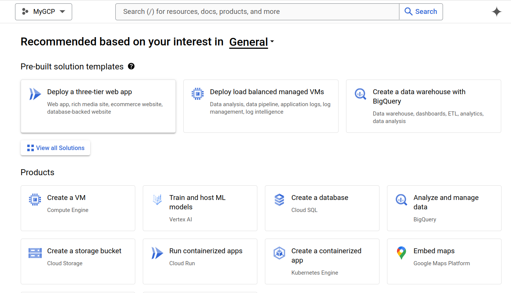
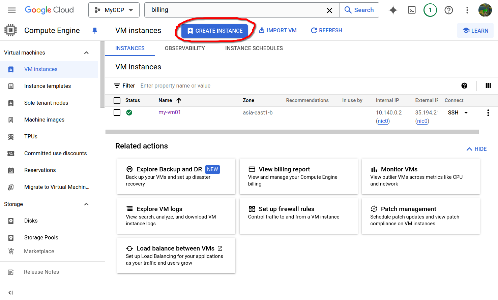
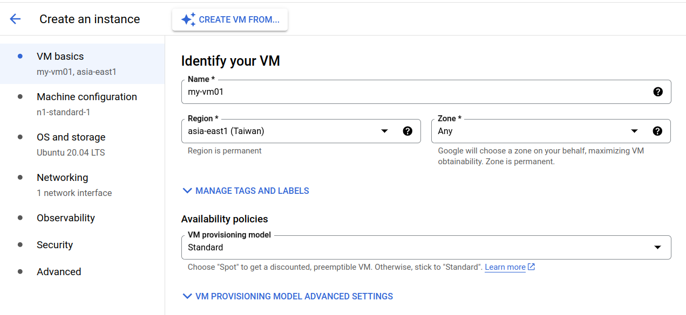
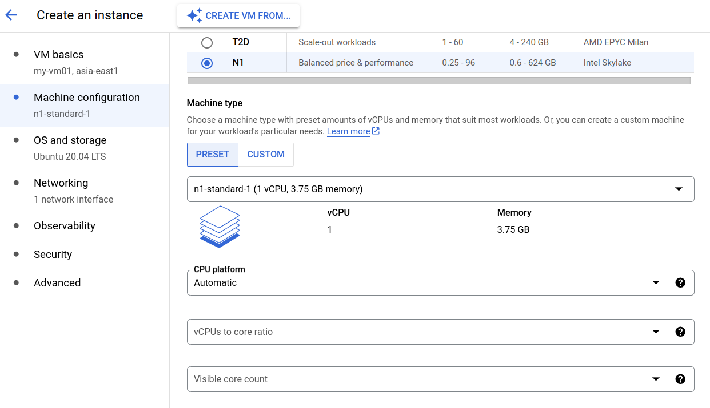
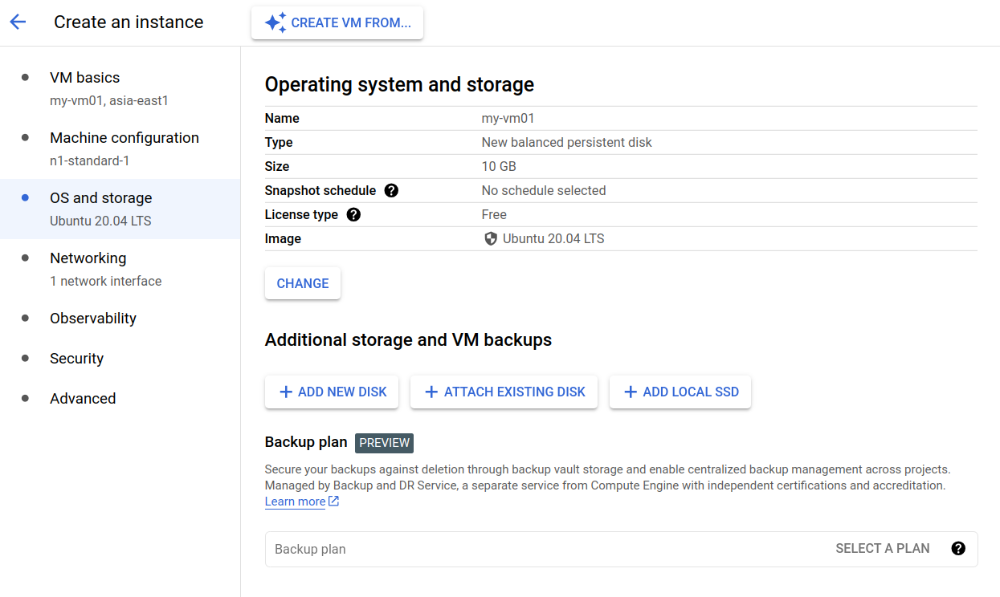
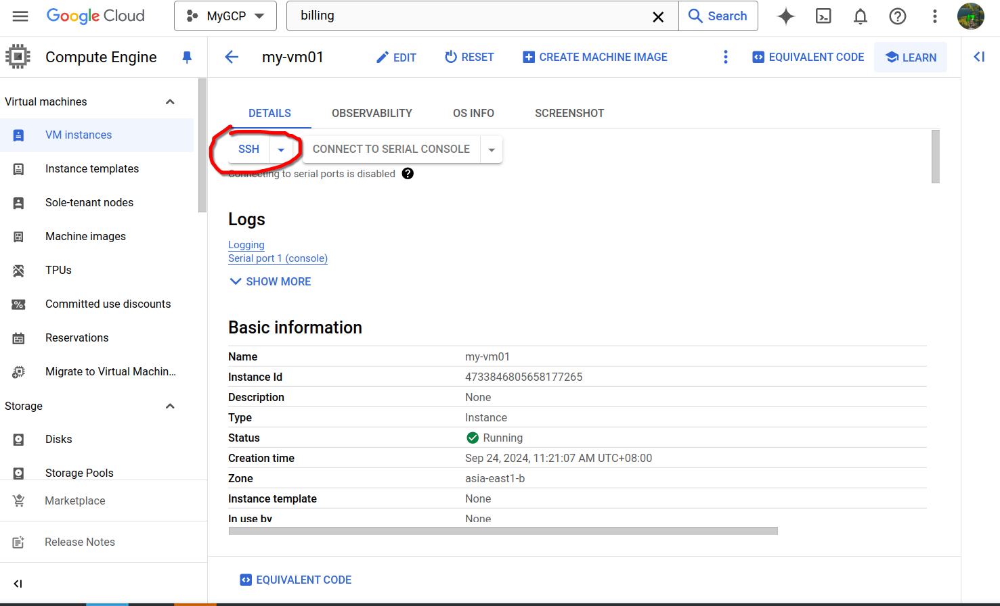
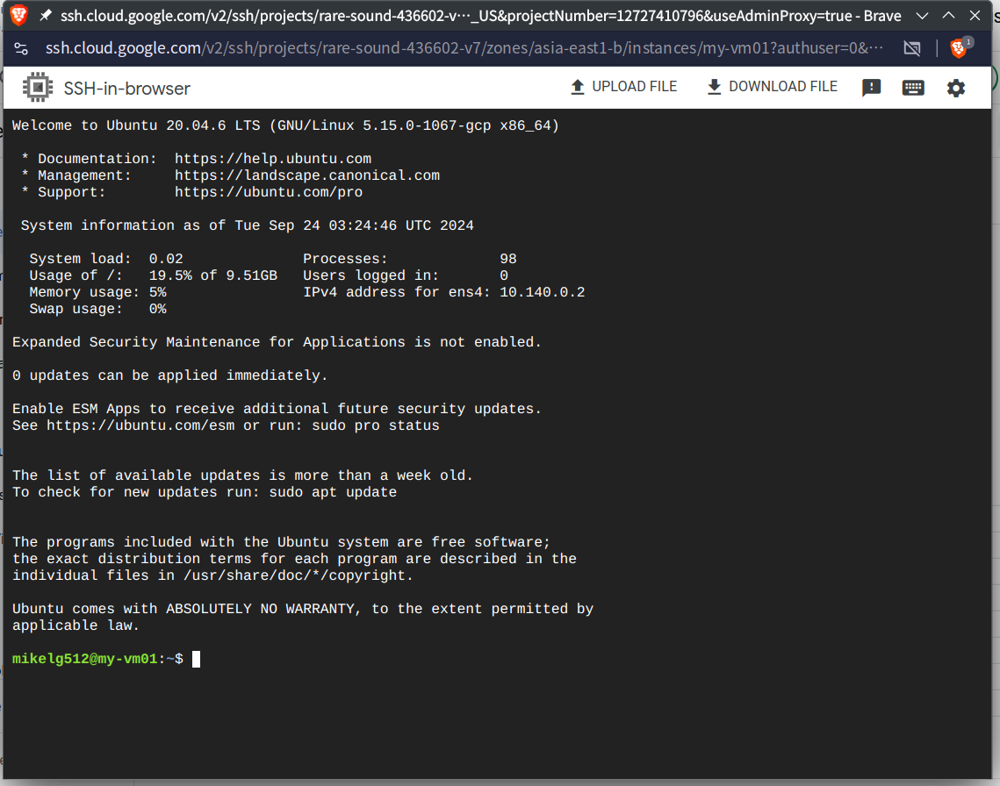
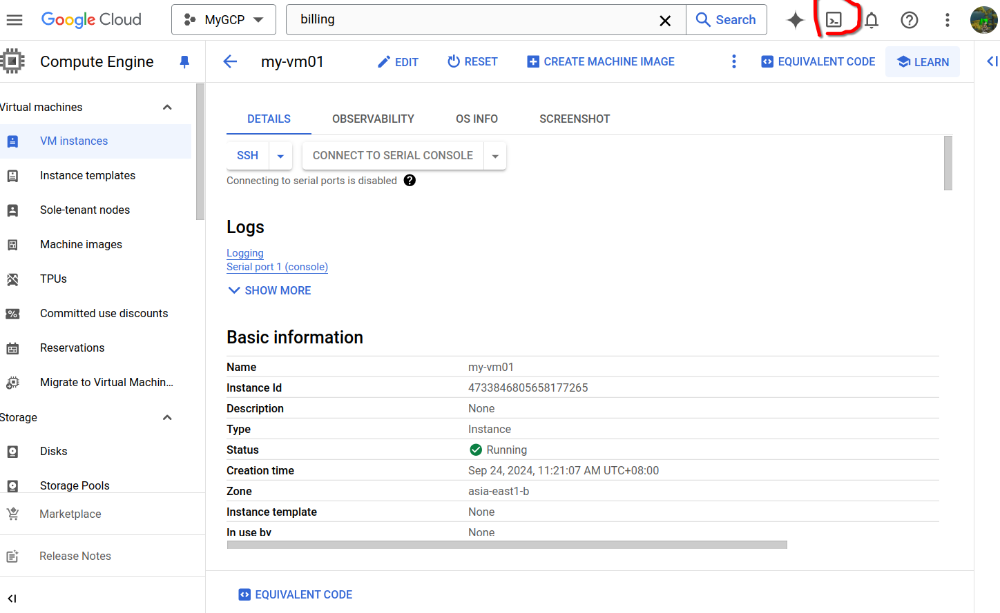
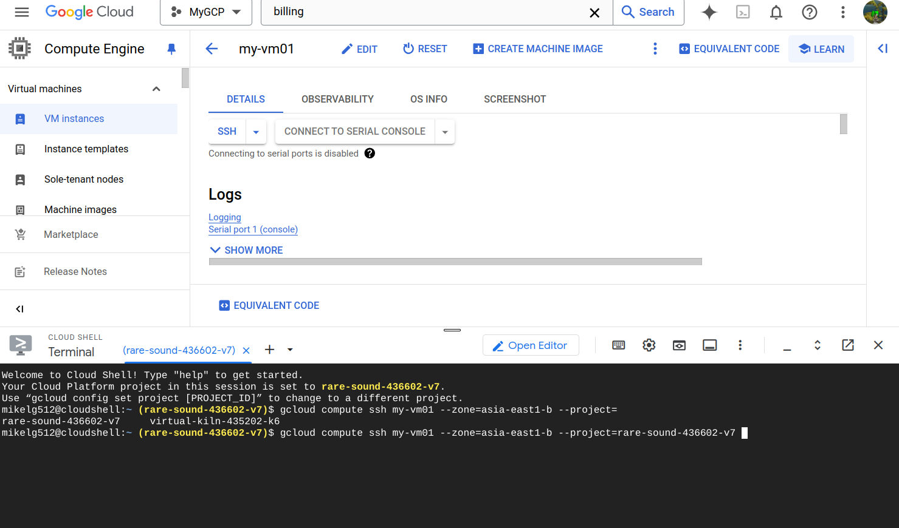
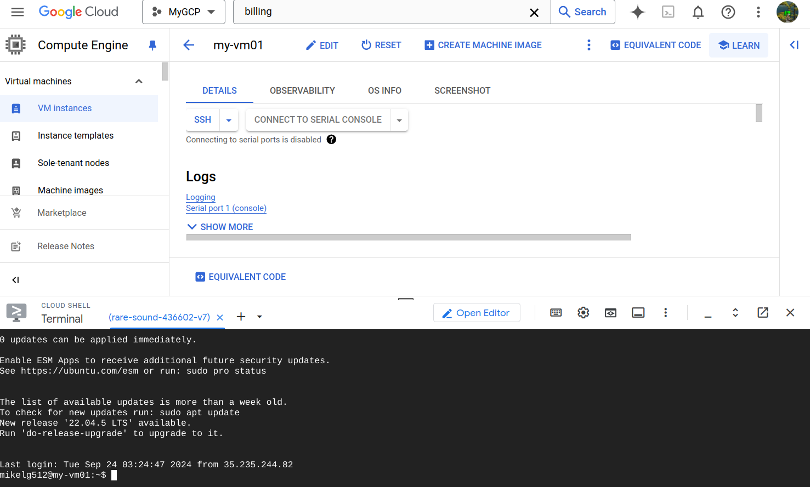

# 第三週

簡單介紹各大語言模型（Gemeni, GPT4o）。 
介紹大語言模型整合至Google Docs及各項參數。

## 為什麼要使用雲端服務？

> todo

1. Pay as you need.
2. Reducd latency.
3. Add reliability. (?
4. Law. (?

## 建立新的GCP project

左上角 `Google Cloud` icon 旁，有下拉式選單可以選擇 project 。 
建立新 project 名為 `MyGCP`

## 建立虛擬機

其他預設就好

## 注意事項
***關閉虛擬機後仍須為硬碟等儲存系統付費，若確定不使用虛擬機，記得刪除***

## 連線到虛擬機的三種方法
1. SSH
    

    

2. Cloud Shell
    

    

    

3. google-cloud-cli
