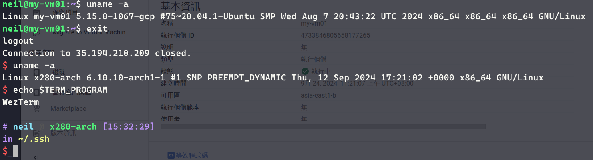

# 第三週

簡單介紹各大語言模型（Gemeni, GPT4o）。<br>
介紹大語言模型整合至Google Docs及各項參數。

## 為什麼要使用雲端服務？

1. Pay as you need.<br>
    用多少付多少，減少使用在硬體的預算。
2. Reduce latency.<br>
    可以在欲提供服務的地區建立伺服器，降低延遲。
3. More reliability.<br>
    雲端服務可以快速進行伺服器的縮容與括容，其中一部硬體出問題依舊可以提供服務。
4. Law.<br>
    有些國家的法律禁止將國民的資料存放在外國伺服器，運用雲端服務將伺服器建立在當地可規避此類型法律問題。

## 建立新的GCP project

左上角 `Google Cloud` icon 旁，有下拉式選單可以選擇 project 。<br>
建立新 project 名為 `MyGCP`


## 建立虛擬機


其他預設就好

## 注意事項
***關閉虛擬機後仍須為硬碟等儲存系統付費，若確定不使用虛擬機，記得刪除***

## 連線到虛擬機的三種方法
1. SSH
    

    

2. Cloud Shell
    

    

    

3. google-cloud-cli
    * 安裝
        * 官方文件：[Install the gcloud CLI  |  Google Cloud CLI Documentation](https://cloud.google.com/sdk/docs/install#deb)
        * archlinux(install from AUR)：
            ```
            yay -S google-cloud-cli
            ```
    * 連線
        ```
        gcloud compute ssh {VM_NAME} --zone={ZONE} --project={PROJECT_NAME}
        ```
        ex:
        ```
        gcloud compute ssh my-vm01 --zone=asia-east1-b --porject=rare-sound-436682-v7
        ```

        
