# 第四週

## 雲端服務的選擇
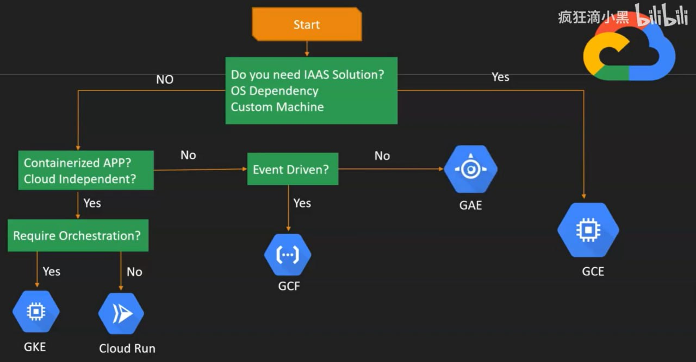

* 如果單純使用Docker環境，可以選擇`Cloud Run`

* 如果要考慮自動括容、縮容、更高可靠度，可選擇`Kubernetes (k8s)`

* 如果是事件驅動的APP，可使用`GCF (Google Cloud Function)`

* 非事件驅動的APP，可選擇`GAE (Google App Engine)`

* 想要自己實做運維、有更大自由度的雲端服務，可選擇`GCE (Google Compute Engine)`

## 建立http伺服器
- ***記得勾選`allow HTTP traffic`***

* 手動建立
    1. 建立虛擬機後，更新軟體資料庫：
        ```bash
        sudo apt update
        ```
    2. 安裝`apache`伺服器：
        ```bash
        sudo apt install apache2
        ```
    3. 確認是否安裝成功&啟動：
        ```bash
        sudo systemctl status apache2
        ```
    4. （可選）安裝`net-tools`，用來確認伺服器是否正在監聽對應埠號：
        ```bash
        sudo apt install net-tools
        sudo netstat -tunlp | grep 80
        ```
    5. 使用瀏覽器連上虛擬機的public IP：
        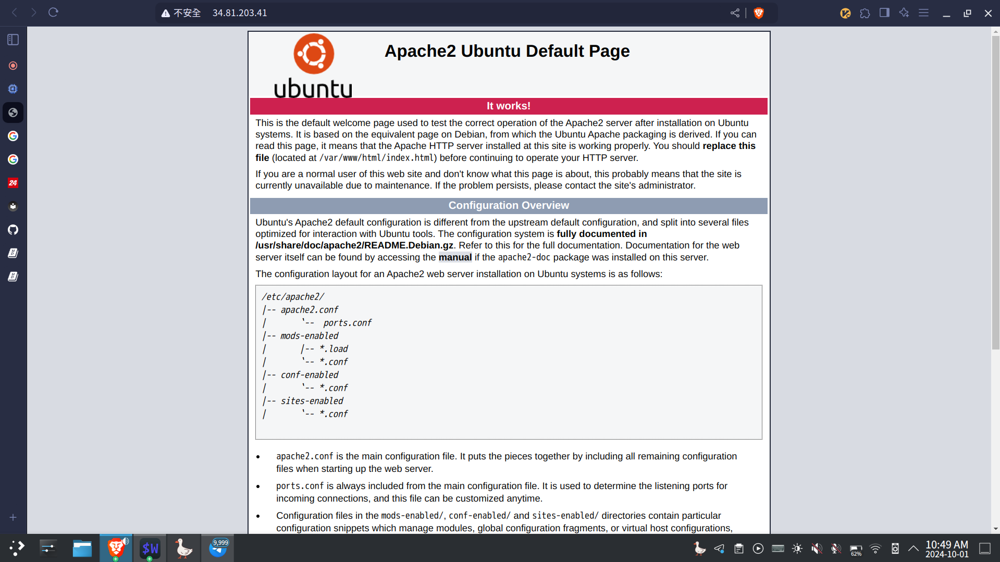
    6. 新增`hi.htm`頁面到`/var/www/html`：
        ```bash
        sudo bash -c "echo 'hi' > hi.htm"
        ```
    7. 用瀏覽器開啟該頁面：<br>
        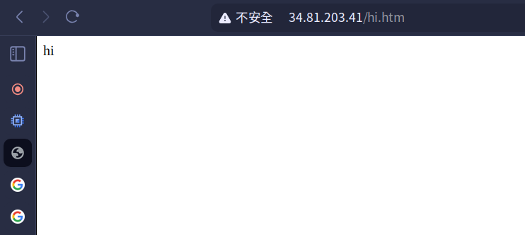
    8. 新增`test.htm`頁面，確認有load balancer時，伺服器端的ip
        ```bash
        sudo bash -c 'echo "$(hostname -I)" > test.htm'
        ```
* 腳本建立
    - 在建立虛擬機時，`進階`頁面中的自動化的開機指令碼欄位中填入以下腳本指令碼：
        ```bash
        #!/bin/bash
        apt update
        apt -y install apache2
        cat <<EOF > /var/www/html/index.html
        <html><body><p>Linux startup script added directly. $(hostname -I)</p></body></html>
        ```
    - 開機後等待約3分鐘，待腳本執行完畢後，連上虛擬機public IP：
        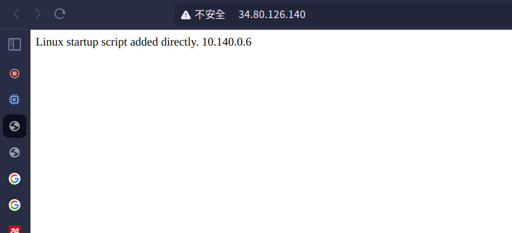

## 由虛擬機建立映像檔
***映像檔會佔用雲端空間，確定不用時記得刪除，不然會一直計費***
* 在`映像檔 （Images）`頁面，點擊`CREATE IMAGE`，設定映像檔名稱及映像檔來源（先關閉作為來源的虛擬機）：
    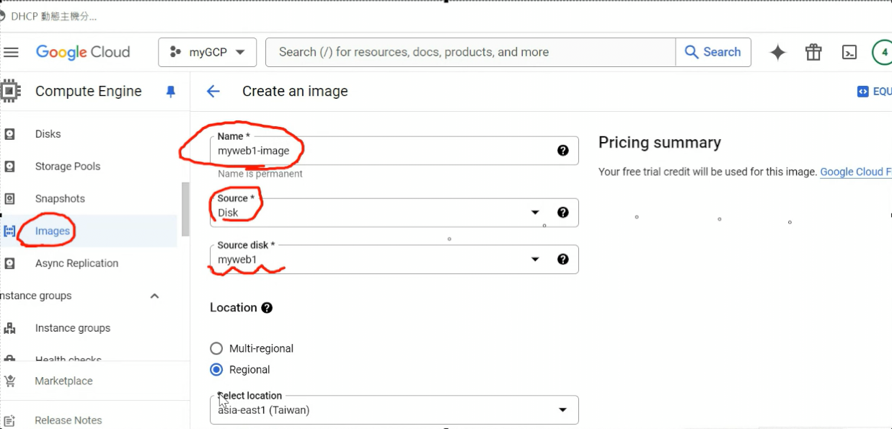
* 映像檔建立完成後，點選建立虛擬機：
    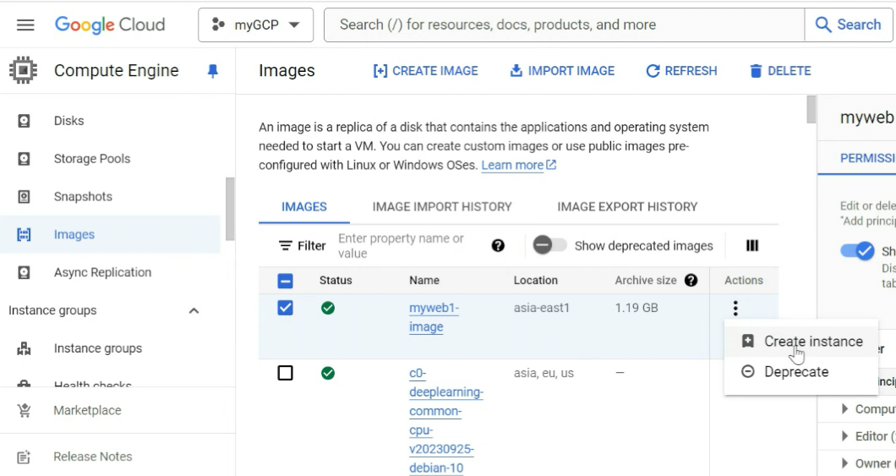
* 虛擬機建立完成：
    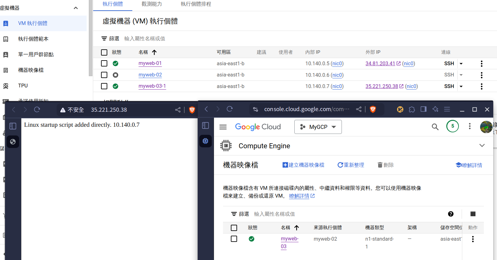

## 固定public IP
* 建立或編輯虛擬機 -> 網路：
    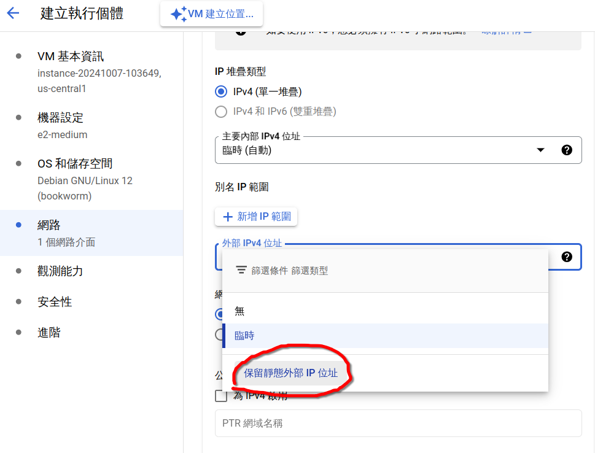
    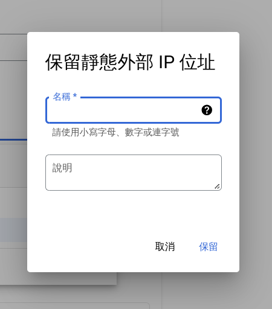

    點選保留後，虛擬機就有一組固定的public IP。

***固定IP會額外計費，若不使用建議釋出***
* 釋出固定IP
    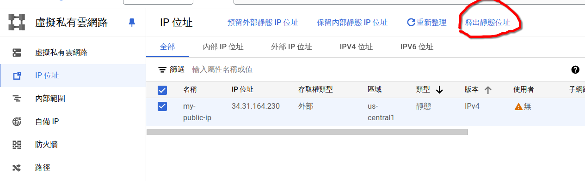

## DNS
**老師推薦的免費DNS： [dynv6](https://dynv6.com)**

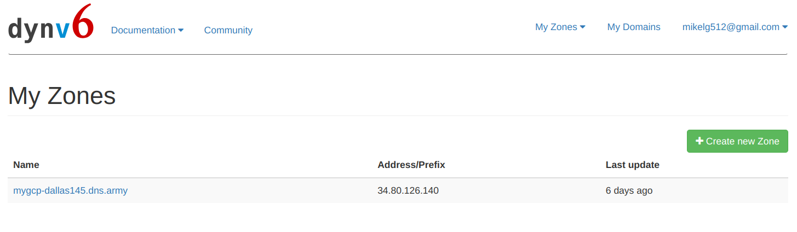

註冊登入後，點擊`Create new Zone`<br>
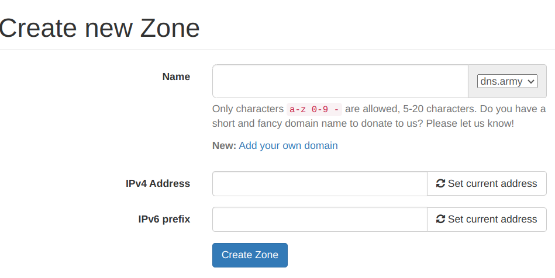

設定`Name`欄位，並在`IPv4 Address`欄位填入虛擬機的public IP，點擊`Create Zone`即完成DNS建立<br>
> 在瀏覽器輸入網址時，沒有ssl憑證的話，要自己輸入`http://`，不然通常瀏覽器會自動帶入`https://`，導致無法正常連線

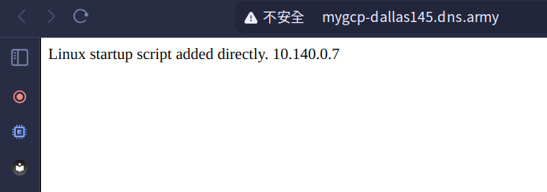

## 最後
***記得刪除不用的虛擬機***
