# 第五週

## 課前補充介紹

### [NotebookLM](https://notebooklm.google/)

可以上傳PDF，讓AI整理重點。 
NotebookLM會提供範例問題讓你提問，加快你了解上傳檔案的內容。 
不只可以上傳PDF，也可以提供網址，甚至是影片，NotebookLM都可以根據其內容回答你的提問。

## Budgets & alerts
可以設定預算，達到指定的數字會自動寄email 
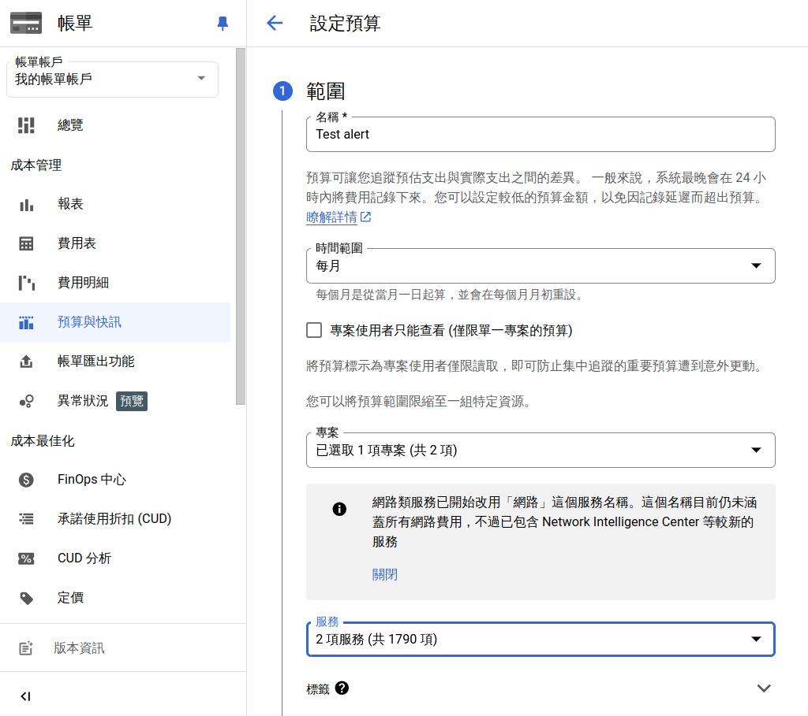

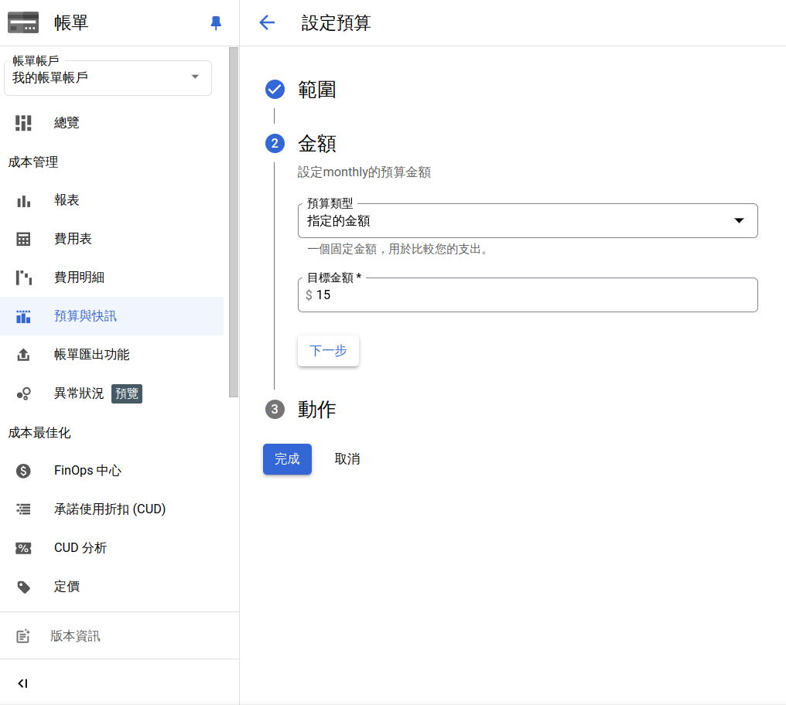

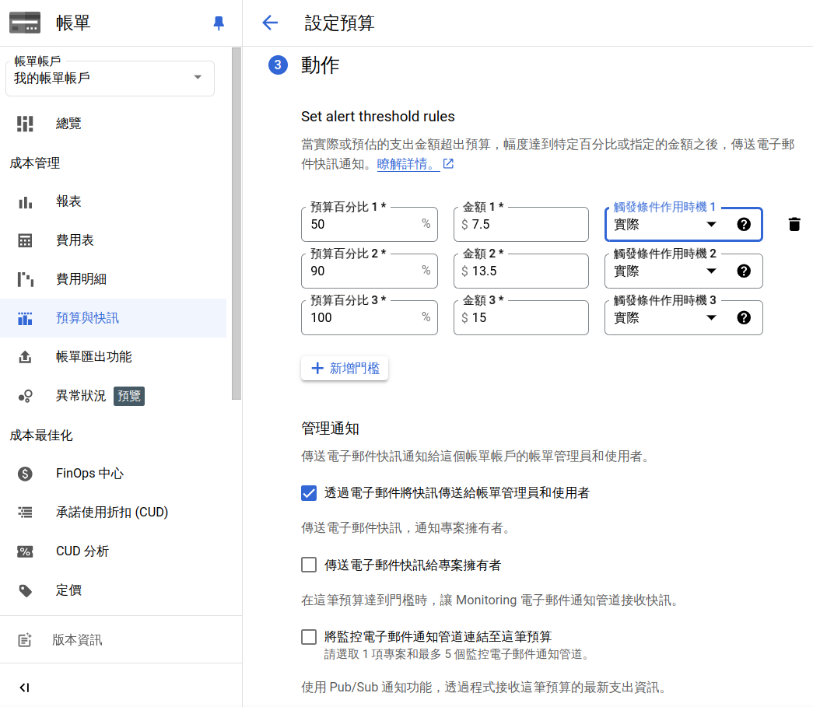

## Upload file to cloud storage and copy it to GCE

* 方法一：從GCP網頁建立Cloud Storage bucket後，直接上傳
    1. 建立bucket： 
    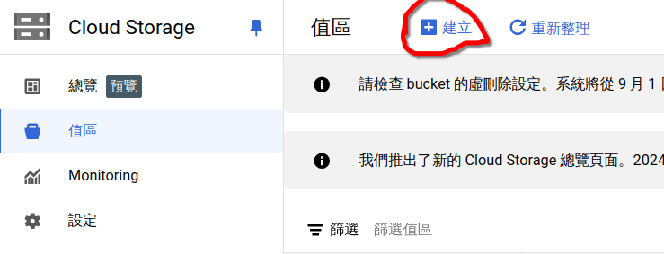 
    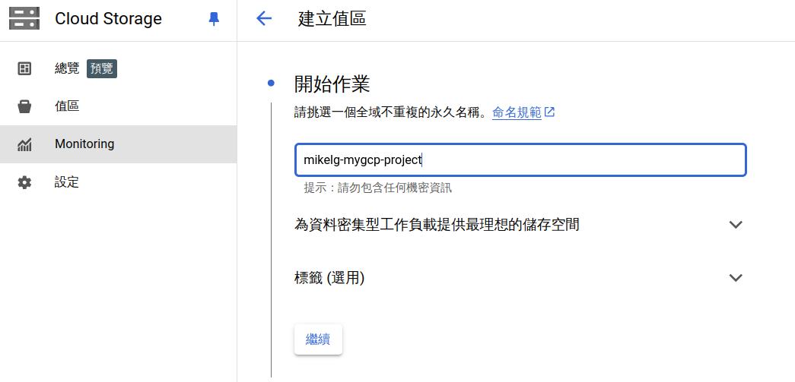 
    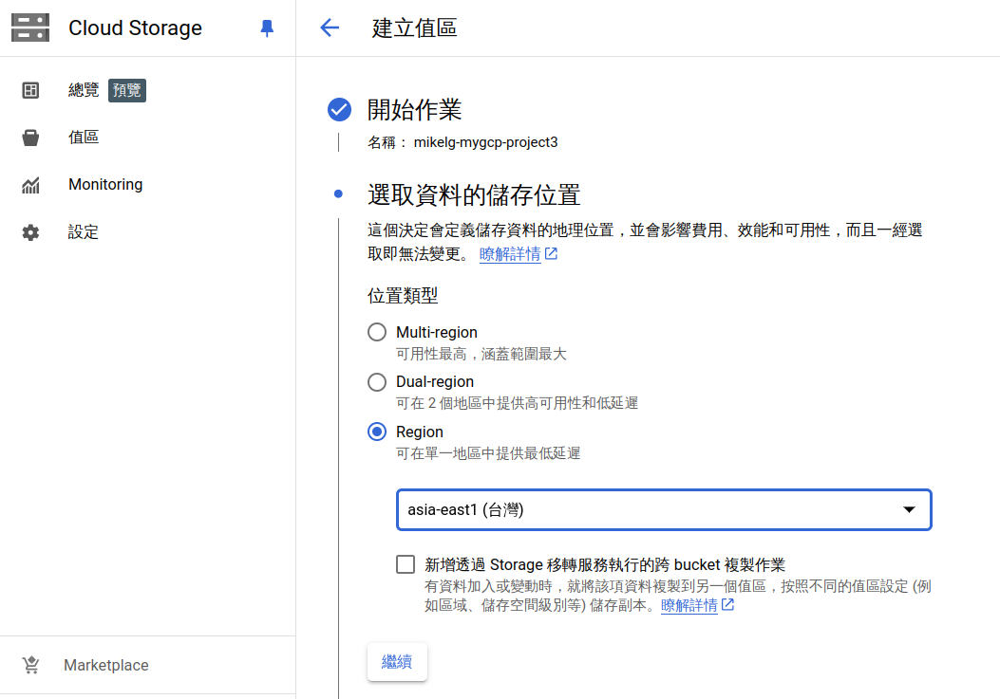 
    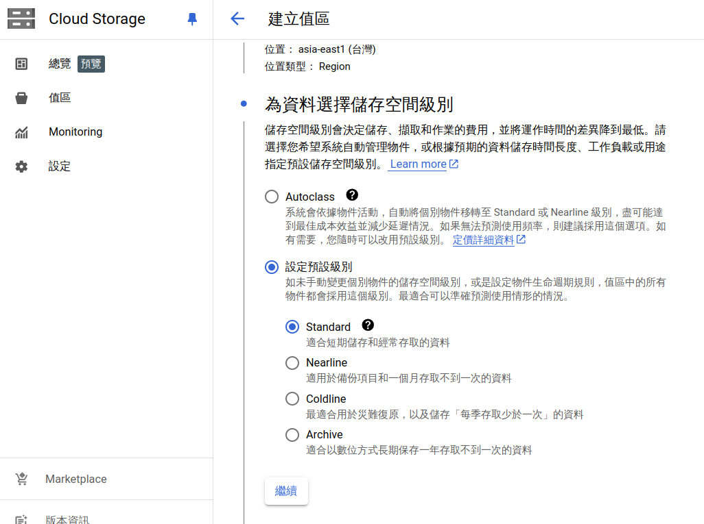 
    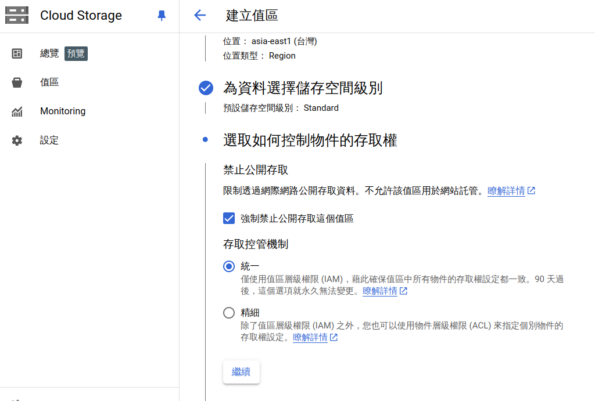 
    2. 點選`上傳`： 
    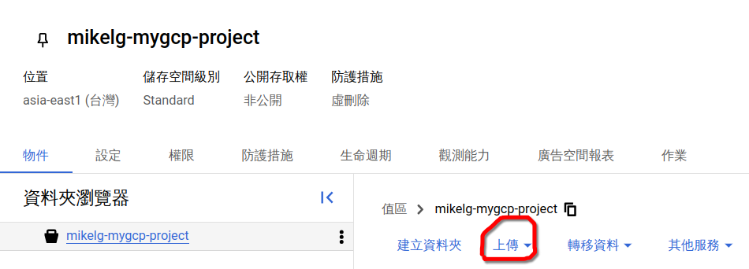 

* 方法二：從GCP網頁建立Cloud Storage bucket後，從Cloud Shell上傳
    1. 建立bucket： 
    同上 
    2. 開啟`Cloud Shell` 
    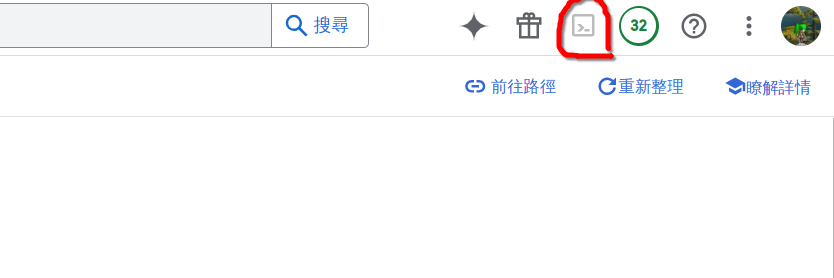 
    3. 點擊上傳 
    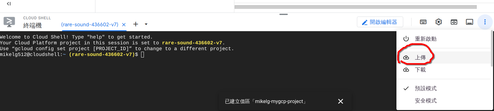 
    預設目的地是家目錄 
    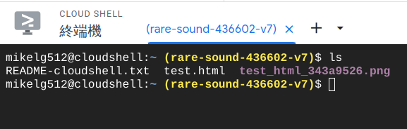 
    4. 執行`gsutil ls`並授權執行，列出可用bucket 
    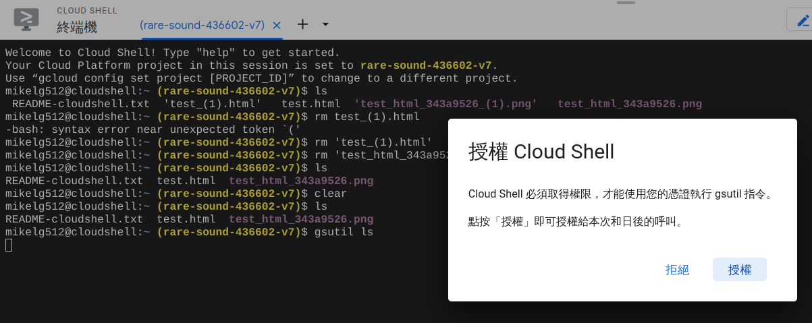 
    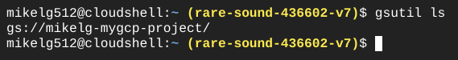 
    5. 執行`gsutil cp`指令，將檔案複製到bucket 
    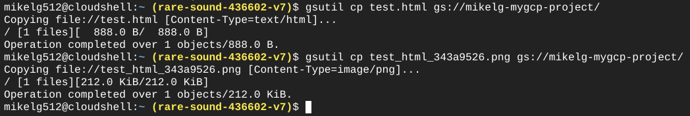 
    6. 到Cloud Storage頁面檢查是否成功上傳 
    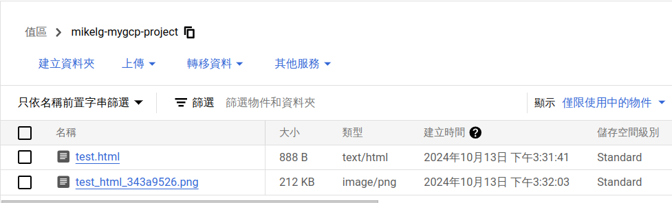 

### 將檔案從Cloud Storage複製到Compute Engine

建立虛擬機時，安全性部份為求方便（日後可以將檔案從Compute Engine複製至Cloud Storage），設定允許Cloud API的完整存取權 
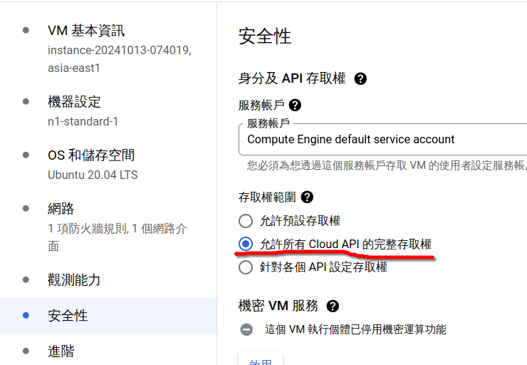 

## Download file from compute engine to local machine

- [ ] todo: finish download file from compute engine to local machien

### ~~Create a service account to~~ solve the access denied problem
[google cloud storage - gsutil copy returning "AccessDeniedException: 403 Insufficient Permission" from GCE - Stack Overflow](https://stackoverflow.com/questions/27275063/gsutil-copy-returning-accessdeniedexception-403-insufficient-permission-from)

- [ ] todo: finish this note by watch course video.
