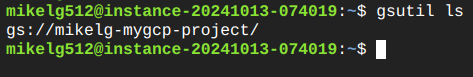
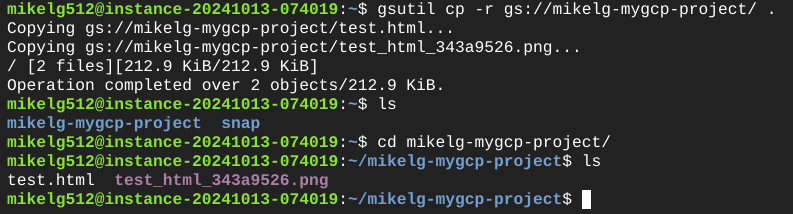
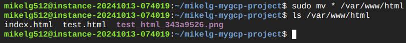
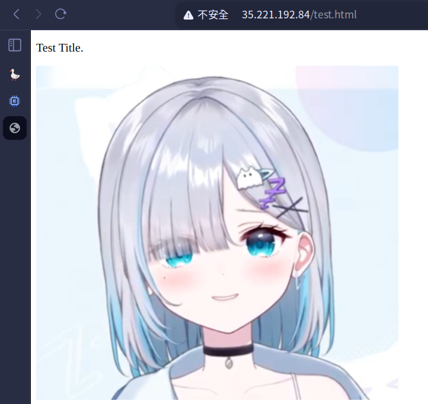
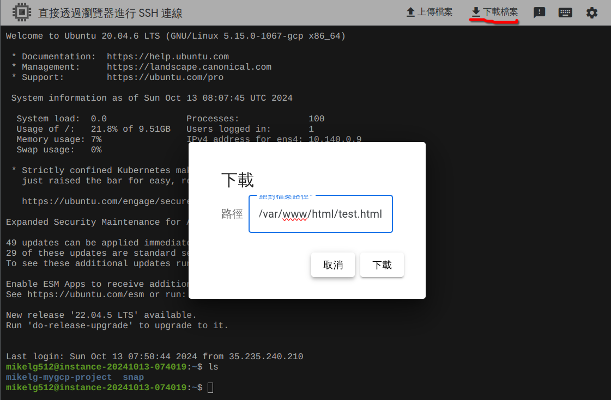
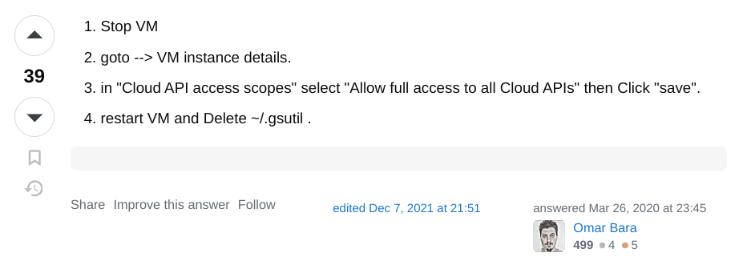
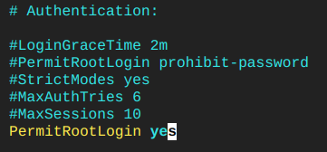
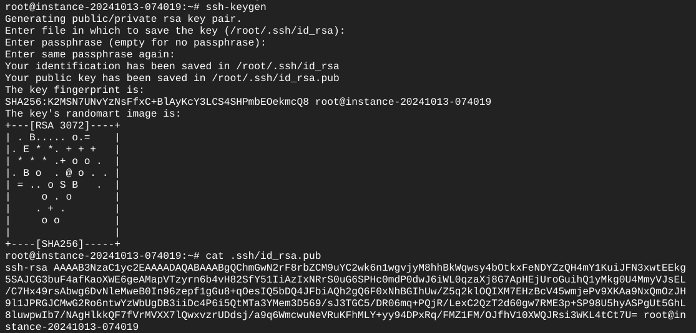
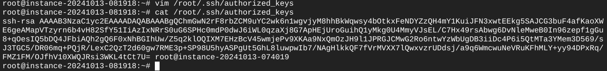
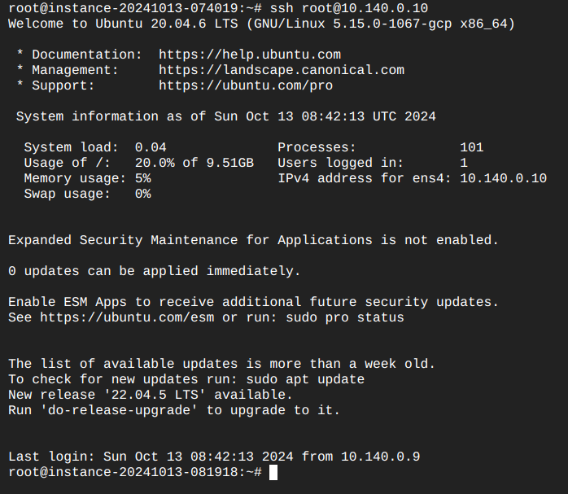

# 第五週

## 課前補充介紹

### [NotebookLM](https://notebooklm.google/)

可以上傳PDF，讓AI整理重點。<br>
NotebookLM會提供範例問題讓你提問，加快你了解上傳檔案的內容。<br>
不只可以上傳PDF，也可以提供網址，甚至是影片，NotebookLM都可以根據其內容回答你的提問。

## Budgets & alerts
可以設定預算，達到指定的數字會自動寄email<br>


## Upload file to cloud storage and copy it to GCE

* 方法一：從GCP網頁建立Cloud Storage bucket後，直接上傳
    1. 建立bucket：<br>
    <br>
    <br>
    <br>
    <br>
    <br>
    2. 點選`上傳`：<br>
    <br>

* 方法二：從GCP網頁建立Cloud Storage bucket後，從Cloud Shell上傳
    1. 建立bucket：<br>
    同上<br>
    2. 開啟`Cloud Shell`<br>
    <br>
    3. 點擊上傳<br>
    <br>
    預設目的地是家目錄<br>
    <br>
    4. 執行`gsutil ls`並授權執行，列出可用bucket<br>
    <br>
    <br>
    5. 執行`gsutil cp`指令，將檔案複製到bucket<br>
    <br>
    6. 到Cloud Storage頁面檢查是否成功上傳<br>
    <br>

### 將檔案從Cloud Storage複製到Compute Engine

建立虛擬機時，安全性部份為求方便（日後可以將檔案從Compute Engine複製至Cloud Storage），設定允許Cloud API的完整存取權<br>
<br>
在虛擬機執行`gsutil ls`指令，列出可用bucket：<br>
<br>
使用`gsutil cp`指令，將檔案複製到虛擬機：<br>
<br>
更新APT並安裝apache2伺服器：<br>
```bash
sudo apt update && sudo apt install apache2 -y
```
使用`mv`指令將檔案移到`/var/www/html`路徑：<br>
<br>
在瀏覽器檢視檔案：<br>
<br>

## Download file from compute engine to local machine

在瀏覽器SSH終端機點擊下載檔案並填入檔案的絕對路徑：<br>
<br>
<br>

### ~~Create a service account to~~ solve the access denied problem
[google cloud storage - gsutil copy returning "AccessDeniedException: 403 Insufficient Permission" from GCE - Stack Overflow](https://stackoverflow.com/questions/27275063/gsutil-copy-returning-accessdeniedexception-403-insufficient-permission-from)



## 在Compute Engine使用SSH連上另一台虛擬機
1. 先設定root密碼（兩台都要）<br>
```bash
sudo passwd root
```
2. 在被控端的`/etc/ssh/sshd_config`中加入<br>
```
PermitRootLogin yes
```
並重啟`sshd`<br>
```bash
systemctl restart sshd
```
<br>
3. 在主控端執行`ssh-keygen`
<br>
4. 將主控端的`id_rsa.pub`key複製到被控端的`/root/.ssh/authorized_keys`裡<br>
<br>

設定完成即可連線<br>
<br>

