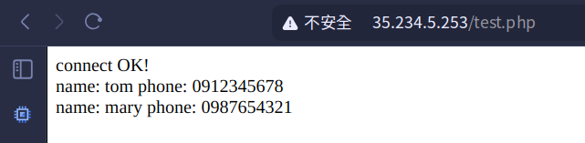
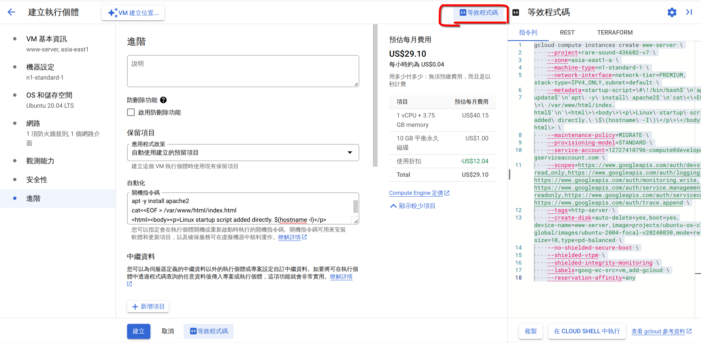
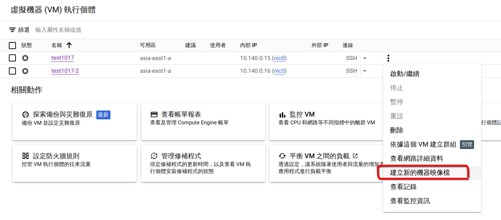

# 第六週

## 課前介紹：Chrome 即時字幕

## Database server(LAMP)
建立兩台虛擬機：<br>
- www-server:<br>
    * asia-east1
    * n1-standard
    * ubuntu 20.04
    * allow http traffic
    * startup script:<br>
        ```bash
        #!/bin/bash
        apt update
        apt -y install apache2
        cat<<EOF > /var/www/html/index.html
        <html><body><p>Linux startup script added directly. $(hostname -I)</p></body></html>
        ```
- db-server:<br>
    * asia-east1
    * n1-standard
    * **ubuntu 22.04**<br>
    * Follow the instructions to install and setup mariadb:<br>
        [在 Ubuntu 22.04 安裝 MariaDB 資料庫 | 塔斯日誌](https://blog.tarswork.com/post/mariadb-install-record)<br>
        其中，第三章**允許外部連線**處，新增資料庫權限的指令改為<br>
        ```sql
        GRANT ALL PRIVILEGES ON *.* TO 'root'@'%' IDENTIFIED BY '123456' WITH GRANT OPTION;
        FLUSH PRIVILEGES;
        ```

1. 在db-server:
    ```bash
    mysql -uroot -p123456
    ```
    執行以下sql指令：
    ```sql
    /* 顯示目前有的資料庫 */
    show databases;   
    /* 創建資料庫 */
    create database testdb;   
    /*  使用資料庫 */
    use testdb;  
    /* 創建資料表 */
    create table addrbook(name varchar(50) not null, phone char(10));
    /* 加入資料 */
    insert into addrbook(name, phone) values ("tom", "0912123456");
    insert into addrbook(name, phone) values ("mary", "0912123567");
    /* 選擇資料 */
    select name,phone from addrbook;
    ```
2. 在www-server:<br>
    安裝mysql-client，測試mysql連線
    ```bash
    sudo apt install mysql-client
    mysql -h <db-sever_ip> -uroot -p123456
    ```
    ```sql
    SHOW DATABASES;
    USE testdb;
    SHOW TABLES;
    SELECT * FROM addrbook
    ```
    Follow [安裝 PHP 8.1 版 | 晟鑫科技線上手冊](https://docs.ossii.com.tw/books/ubuntu-server-2004-apache-mariadb-php/page/php-81) to install php8.1
    ```bash
    sudo vim /var/www/html/test.php
    ```
    ```php
    <?php
    $servername="10.140.0.13"; //db-server的ip
    $username="root";    
    $password="123456";
    $dbname="testdb";

    $conn = new mysqli($servername, $username, $password, $dbname);

    if($conn->connect_error){
        die("connection failed: " . $conn->connect_error);
    }
    else{
        echo "connect OK!" . "<br>";
    }

    $sql="select name,phone from addrbook";
    $result=$conn->query($sql);

    if($result->num_rows>0){
        while($row=$result->fetch_assoc()){
            echo "name: " . $row["name"] . "\tphone: " . $row["phone"] . "<br>";
        }
    } else {
        echo "0 record";
    }
    ?>
    ```

3. 在瀏覽器裡開啟`http://<www-server_ip>/test.php`
    

## 等效程式碼：用指令建立虛擬機實現自動化
在GCP網頁圖形化界面把建立虛擬機的選項依據需求選完，點擊`等效程式碼`按鈕，即可產生對應程式碼，在GCP Cloud Shell或本機安裝的`gcloud`指令執行即可快速建立雲端伺服器。<br>

以本週的`www-server`為例：<br>
單行顯示：<br>
```bash
gcloud compute instances create www-server --project=rare-sound-436602-v7 --zone=asia-east1-a --machine-type=n1-standard-1 --network-interface=network-tier=PREMIUM,stack-type=IPV4_ONLY,subnet=default --metadata=startup-script=\#\!/bin/bash$'\n'apt\ update$'\n'apt\ -y\ install\ apache2$'\n'cat\<\<EOF\ \>\ /var/www/html/index.html$'\n'\<html\>\<body\>\<p\>Linux\ startup\ script\ added\ directly.\ \$\(hostname\ -I\)\</p\>\</body\>\</html\> --maintenance-policy=MIGRATE --provisioning-model=STANDARD --service-account=12727410796-compute@developer.gserviceaccount.com --scopes=https://www.googleapis.com/auth/devstorage.read_only,https://www.googleapis.com/auth/logging.write,https://www.googleapis.com/auth/monitoring.write,https://www.googleapis.com/auth/service.management.readonly,https://www.googleapis.com/auth/servicecontrol,https://www.googleapis.com/auth/trace.append --tags=http-server --create-disk=auto-delete=yes,boot=yes,device-name=www-server,image=projects/ubuntu-os-cloud/global/images/ubuntu-2004-focal-v20240830,mode=rw,size=10,type=pd-balanced --no-shielded-secure-boot --shielded-vtpm --shielded-integrity-monitoring --labels=goog-ec-src=vm_add-gcloud --reservation-affinity=any
```
分行顯示：<br>
```bash
gcloud compute instances create www-server \
    --project=rare-sound-436602-v7 \
    --zone=asia-east1-a \
    --machine-type=n1-standard-1 \
    --network-interface=network-tier=PREMIUM,stack-type=IPV4_ONLY,subnet=default \
    --metadata=startup-script=\#\!/bin/bash$'\n'apt\ \
update$'\n'apt\ -y\ install\ apache2$'\n'cat\<\<EOF\ \>\ /var/www/html/index.html$'\n'\<html\>\<body\>\<p\>Linux\ startup\ script\ added\ directly.\ \$\(hostname\ -I\)\</p\>\</body\>\</html\> \
    --maintenance-policy=MIGRATE \
    --provisioning-model=STANDARD \
    --service-account=12727410796-compute@developer.gserviceaccount.com \
    --scopes=https://www.googleapis.com/auth/devstorage.read_only,https://www.googleapis.com/auth/logging.write,https://www.googleapis.com/auth/monitoring.write,https://www.googleapis.com/auth/service.management.readonly,https://www.googleapis.com/auth/servicecontrol,https://www.googleapis.com/auth/trace.append \
    --tags=http-server \
    --create-disk=auto-delete=yes,boot=yes,device-name=www-server,image=projects/ubuntu-os-cloud/global/images/ubuntu-2004-focal-v20240830,mode=rw,size=10,type=pd-balanced \
    --no-shielded-secure-boot \
    --shielded-vtpm \
    --shielded-integrity-monitoring \
    --labels=goog-ec-src=vm_add-gcloud \
    --reservation-affinity=any
```

## image
由已配置完成的虛擬機建立映像檔，可以更方便快速的建立配置相同的虛擬機<br>
在虛擬機關機後，點擊`建立新的機器映像檔`即可建立<br>

