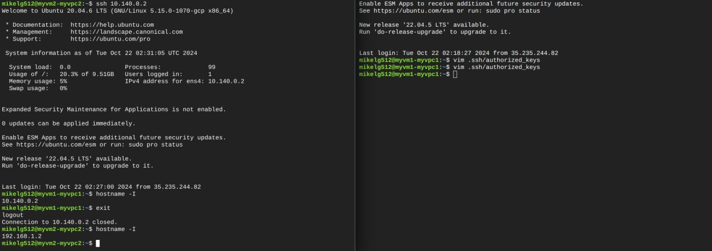
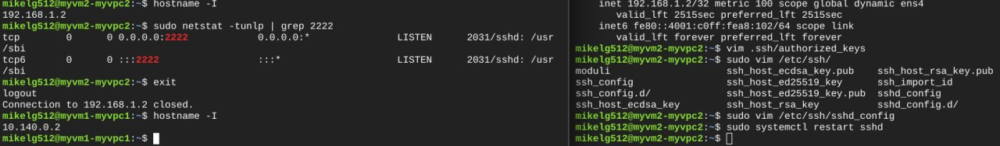
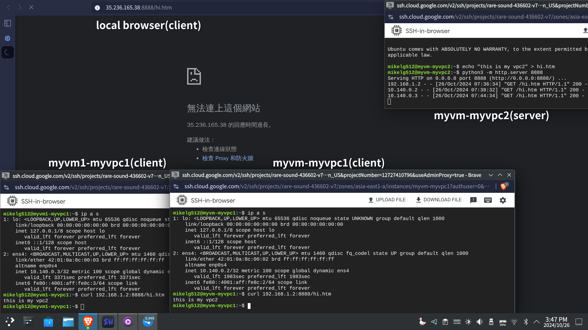

# 第七週

## 課前介紹：轉移billing account
[谷歌云服务Google Cloud（GCP）不换号重新开启300美元试用并且保留老号虚拟机实例的方法 - 山野莽夫](https://www.shanyemangfu.com/gcp-300-old-account.html)

## 建立新的VPC network
> **在同一個VPC下，就算在不同region，虛擬機也可以互相連線。**<br>
> **在不同VPC下，就算在同一個region，虛擬機也不能互相連線。**<br>
> **使用VPC peering，可以打通兩個VPC network，但彼此的IP不能重複。**

建立VPC network：myvpc1
- Name: `myvpc1`
    - Subnet creation mode: `Automatic`
    - Firewall rules:
        * myvpc1-allow-icmp
        * myvpc1-allow-ssh

建立VPC network：myvpc2
- Name: `myvpc2`
    - Subnet creation mode: `Custom`
        * Subnet name: `asia-east1`
        * Subnet description: `TW subnet`
        * Subnet Region: `asia-east1`
        * Subnet IPv4 range: `192.168.1.0/24`

在`myvpc2`建立新的防火牆規則：
- Name: `myvpc2-allow-ssh`
    - Network: `myvpc2`
    - Targets: `All instance in the network`
    - Source filter: `IPv4 ranges`
    - Source IPv4 ranges: `0.0.0.0/0`(anywhere)
    - Protocols and ports: Specified protocols and ports
        * TCP: 22
        * Other: Protocols: icmp

建立虛擬機：
- Name: `myvm-myvpc1`
    * Region: `asia-east1 (Taiwan)`
    * Machine configuration: `N1`
    * OS: `Ubuntu 20.04 LTS`
    * Advanced options -> Network interfaces: `myvpc1`

- Name `myvm-myvpc2`
    * Region: `asia-east1 (Taiwan)`
    * Machine configuration: `N1`
    * OS: `Ubuntu 20.04 LTS`
    * Advanced options -> Network interfaces: `myvpc2`

建立VPC peering
> **要建立雙向才能連線。**
- Name: `myvpc1-myvpc2`
    * Your VPC network: `myvpc1`
    * VPC network name: `myvpc2`

- Name: `myvpc2-myvpc1`
    * Your VPC network: `myvpc2`
    * VPC network name: `myvpc1`

### 隨堂練習
在`mymv-myvpc2`用ssh連上`myvm-myvpc1`<br>


## 實驗
在`myvm-myvpc2`建立簡單網頁伺服器<br>
```bash
echo "hi" > hi.htm
python3 -m http.server 9000
```

* 問題：<br>
    在`myvm-myvpc2`使用`curl http://localhost:9000/hi.htm`可以正常取得資料，但用`myvm-myvpc1`及瀏覽器都無法取得。
* 解法：<br>
    新增防火牆規則
    - Name: `myvpc2-allow-9000`
        - Network: `myvpc2`
        - Targets: `All instance in the network`
        - Source filter: `IPv4 ranges`
        - Source IPv4 ranges: `0.0.0.0/0`(anywhere)
        - Protocols and ports: Specified protocols and ports
            * TCP: 9000
* 結果：<br>
    

### 作業
Change the ssh service from 22 to 2222 in myvpc2. And make the vm in myvpc1 can make a ssh connection to the vm in myvpc2.

修改`/etc/ssh/sshd_config`，將其中的`Port 22`改為`Port 2222`並執行`systemctl restart sshd`重開sshd<br>
再新增防火牆規則<br>
- Name: `myvpc2-allow-2222`
    - Network: `myvpc2`
    - Targets: `All instance in the network`
    - Source filter: `IPv4 ranges`
    - Source IPv4 ranges: `0.0.0.0/0`(anywhere)
    - Protocols and ports: Specified protocols and ports
        - TCP: 2222

即可連線：<br>


### 作業
Running the http server at port 8888 in the vm located in myvpc2. But only the vm in myvpc1 can browse the webpage. The other computer cannot browse the webpage.

新增防火牆規則<br>
- Name: `myvpc2-allow-8888`
    - Network: `myvpc2`
    - Targets: `All instance in the network`
    - Source filter: `IPv4 ranges`
    - Source IPv4 ranges: `10.140.0.0/24` \***(myvpc1 IP range)**
    - Protocols and ports: Specified protocols and ports
        - TCP: 8888

在`myvm-myvpc2`執行：<br>
```bash
echo "this is myvpc2"
python3 -m http:server 8888
```

即可在`myvpc1`上的vm使用`curl 192.168.1.2:8888/hi.htm`(myvm-myvpc2的IP)取得資料。<br>

