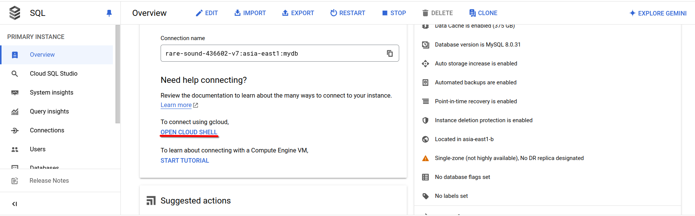

# 第八週

## 課前介紹：perplexity.ai
問答式搜尋引擎

## 課前介紹：xanswer.com
問答式搜尋引擎

## Cloud SQL
***記得 enable `Cloud SQL Admin API`***

Create MySQL instance:<br>
- Cloud SQL edition: `Enterprice Plus`
- Edition preset: `Development`
- Database version: `8.0`
- Instance ID: `mydb`
- Password: `12345678`
- Region: `asia-east1`
- Zonal availablity: `single zone`

建立後初次連線須使用網頁上的按鈕`OPEN CLOUD SHELL`<br>
<br>
其實際作用就是開啟 **Cloud Shell** 並填入以下指令<br>
```bash
gcloud sql connect {Instance ID} --user=root --quiet
```
以上面建立的SQL Instance為例：<br>
```bash
gcloud sql connect mydb --user=root --quiet
```

初次連線後，即可使用`mysql-client`（Cloud Shell中已預先安裝）進行連線：<br>
```bash
mysql -h {Instance IP} -uroot -p
```

編輯`SQL Instance`，將`public IP`改為`private IP`<br>
***注意：改為`private IP`後，就無法再使用`Cloud Shell`連線了！***

建立虛擬機`mywww`：<br>
- mywww:<br>
    * asia-east1
    * n1-standard
    * ubuntu 20.04
    * allow http traffic
 
在`mywww`中安裝`mysql-client`與`apache2`：<br>
```bash
sudo apt install mysql-client apache2 -y
```

用`mysql-client`連上剛建立的`SQL Instance`：<br>
```bash
mysql -h {SQL Instance private IP} -uroot -p
```

安裝`php`並重啟`apache2`：<br>
```bash
sudo apt install php libapache2-mod-php php-mysql
sudo systemctl restart apache2
```

使用`mysql-client`建立資料庫：<br>
```mysql
show databases;
create database testdb;
use testdb;
create table addrbook(name varchar(50) not null, phone char(10));
insert into addrbook(name, phone) values ("tom", "0912345678");
insert into addrbook(name, phone) values ("mary", "0987654321");
select * from addrbook;
```

建立`/var/www/html/testdb.php`並使用`vim`編輯：<br>
```bash
sudo vim /var/www/html/testdb.php
```
```php
<?php
$servername="10.54.240.3";
$username="root";
$password="12345678";
$dbname="testdb";

$conn = new mysqli($servername, $username, $password, $dbname);

if ($conn->connect_error){
        die("connection failed:" .$conn->connect_error);
}
else{
        echo "connect OK!" . "<br>";
}

$sql="select * from addrbook";
$result=$conn->query($sql);

if($result->num_rows>0){
        while($row=$result->fetch_assoc()){
                echo "name:" .$row["name"]."\tphone:" .$row["phone"]. "<br>";
        }
} else {
        echo "0 record";
}
?>
```

- [ ] Watch course video to finish.
