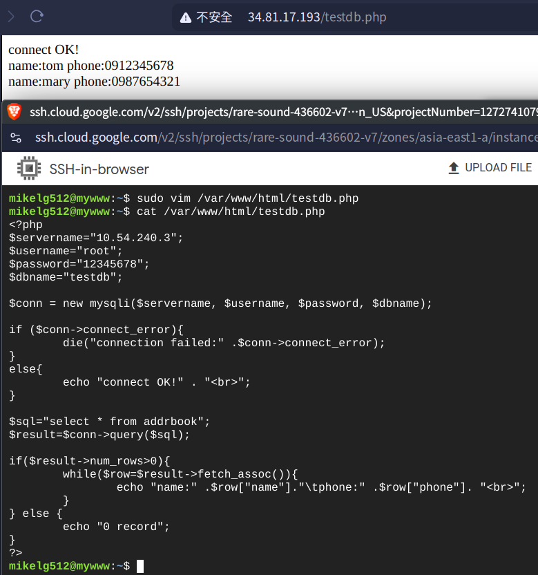
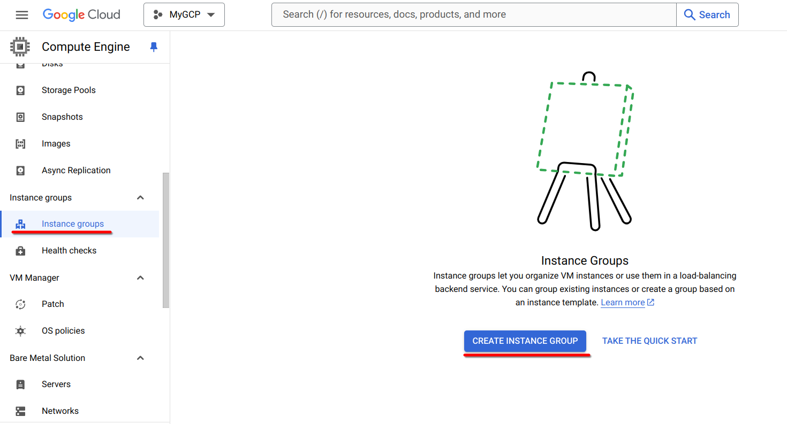
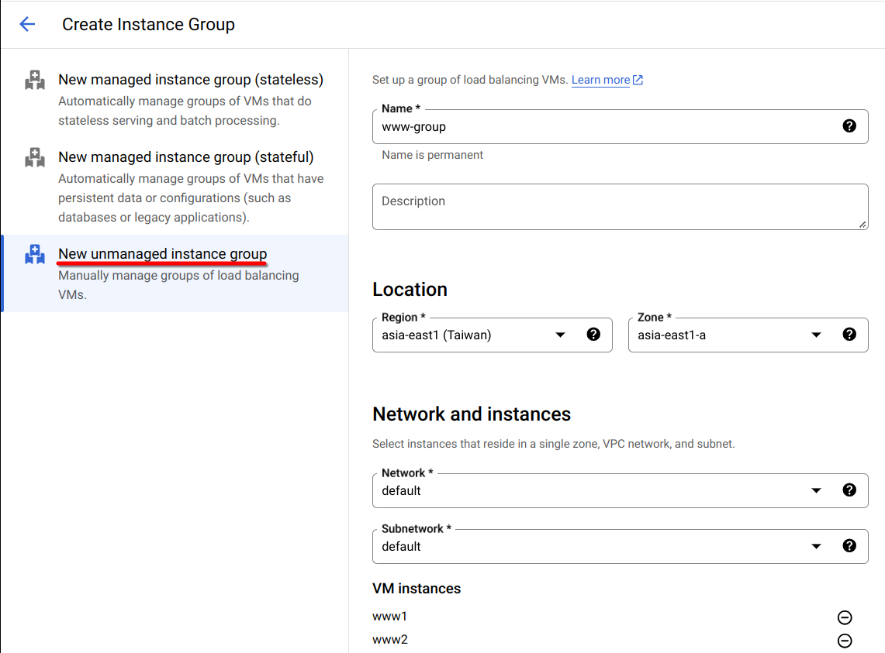
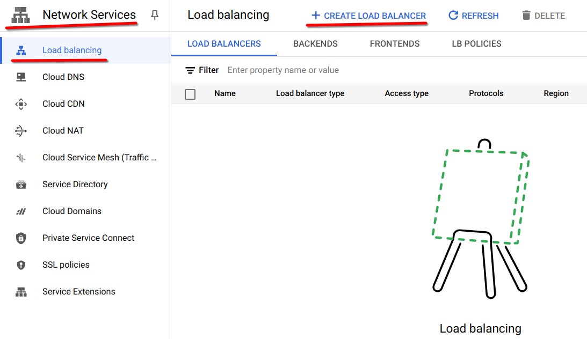
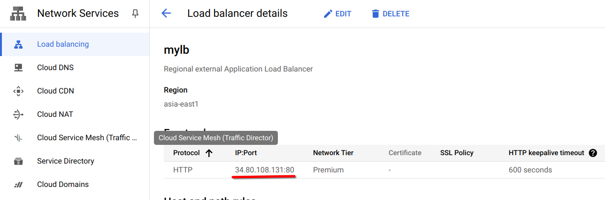
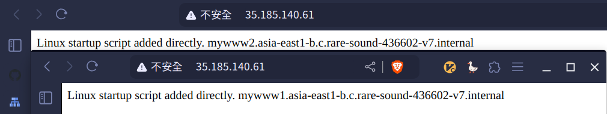

# 第八週

## 課前介紹：perplexity.ai
問答式搜尋引擎

## 課前介紹：xanswer.com
問答式搜尋引擎

## Cloud SQL
***記得 enable `Cloud SQL Admin API`***

Create MySQL instance:<br>
- Cloud SQL edition: `Enterprice Plus`
- Edition preset: `Development`
- Database version: `8.0`
- Instance ID: `mydb`
- Password: `12345678`
- Region: `asia-east1`
- Zonal availablity: `single zone`

建立後初次連線須使用網頁上的按鈕`OPEN CLOUD SHELL`<br>
<br>
其實際作用就是開啟 **Cloud Shell** 並填入以下指令<br>
```bash
gcloud sql connect {Instance ID} --user=root --quiet
```
以上面建立的SQL Instance為例：<br>
```bash
gcloud sql connect mydb --user=root --quiet
```

初次連線後，即可使用`mysql-client`（Cloud Shell中已預先安裝）進行連線：<br>
```bash
mysql -h {Instance IP} -uroot -p
```

編輯`SQL Instance`，將`public IP`改為`private IP`<br>
***注意：改為`private IP`後，就無法再使用`Cloud Shell`連線了！***

建立虛擬機`mywww`：<br>
- mywww:<br>
    * asia-east1
    * n1-standard
    * ubuntu 20.04
    * allow http traffic
 
在`mywww`中安裝`mysql-client`與`apache2`：<br>
```bash
sudo apt install mysql-client apache2 -y
```

用`mysql-client`連上剛建立的`SQL Instance`：<br>
```bash
mysql -h {SQL Instance private IP} -uroot -p
```

安裝`php`並重啟`apache2`：<br>
```bash
sudo apt install php libapache2-mod-php php-mysql
sudo systemctl restart apache2
```

使用`mysql-client`建立資料庫：<br>
```mysql
show databases;
create database testdb;
use testdb;
create table addrbook(name varchar(50) not null, phone char(10));
insert into addrbook(name, phone) values ("tom", "0912345678");
insert into addrbook(name, phone) values ("mary", "0987654321");
select * from addrbook;
```

建立`/var/www/html/testdb.php`並使用`vim`編輯：<br>
```bash
sudo vim /var/www/html/testdb.php
```
```php
<?php
$servername="10.54.240.3"; //SQL Instance 的 IP
$username="root";
$password="12345678";
$dbname="testdb";

$conn = new mysqli($servername, $username, $password, $dbname);

if ($conn->connect_error){
        die("connection failed:" .$conn->connect_error);
}
else{
        echo "connect OK!" . "<br>";
}

$sql="select * from addrbook";
$result=$conn->query($sql);

if($result->num_rows>0){
        while($row=$result->fetch_assoc()){
                echo "name:" .$row["name"]."\tphone:" .$row["phone"]. "<br>";
        }
} else {
        echo "0 record";
}
?>
```

使用瀏覽器開啟`http://{mywww public IP}/testdb.php`<br>


## Load Balancer
建立兩台相同的虛擬機：<br>
- www1 andd www2
    - Region: `asia-east1 (Taiwan)`
    - Machine Configuration: `N1`
    - Operating System: `Ubuntu 20.04 LTS`
    - Firewall: `Allow HTTP traffic`
    - Automation:
        ```bash
        #!/bin/bash
        apt update
        apt install apache2 -y
        cat <<EOF > /var/www/html/index.html
        <html><body><p>Linux startup script added directly. $(hostname -f)</p></body></html>
        ```

建立`Instance Group`：<br>
<br>
<br>
- New unmanaged instance group:
    - Name: `www-group`
    - Location: `asia-east1 (Taiwan)`
    - Zone: `asia-east1-a`（根據前面的虛擬機選）
    - Network: `default`
    - VM instance: `www1 and www2`

建立`Load Balancer`：<br>

- Type of load balancer: `Application Load Balancer (HTTP/HTTPS)`
- Public facing of internal: `Public facing (external)`
- Global of single region deployment: `Best for regional workloads`
- Configure:
    - Load Balancer name: `mylb`
    - Region: `asia-east1 (Taiwan)`
    - Network: `default`
    - Frontend Configuration:
        - Name: `myfrontend`
        - Done.
    - Backend configuration: Create backend service
        - Name: `mybackend`
        - Backend type: `instance group`
        - Backends:
            - Instance group: `www-group`
            - Port numbers: `80`
            - Health check: Create a Health check
                - Name: `httphealthcheck`

建立完成後，找到`Load Balancer`的IP:Port<br>
<br>
檢查是否能連上不同機器：<br>
<br>

在`Cloud Shell`使用`siege`模擬大量使用者存取：<br>
```bash
sudo apt install siege
siege -c 200 -r 200 http://{Load Balancer IP}
```

比較有/無`Load Balancer`的差異：<br>
<br>
