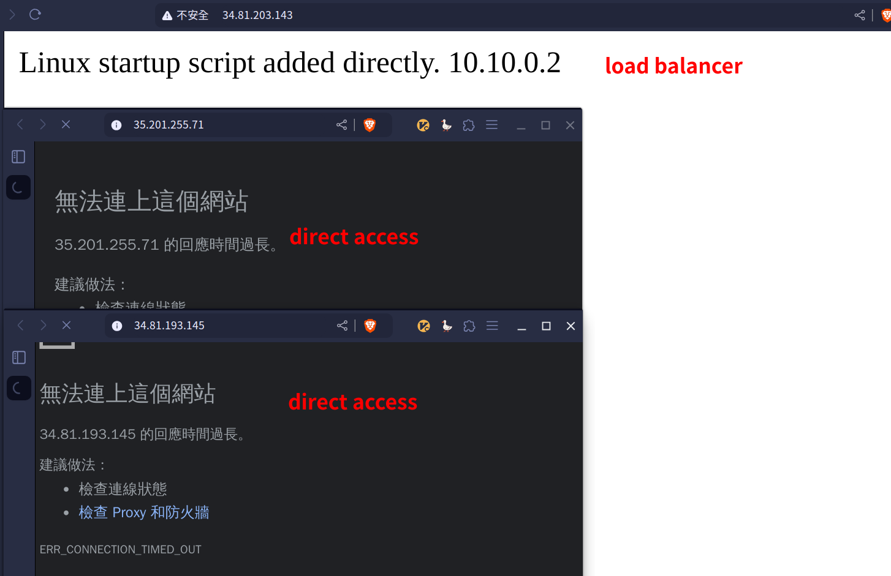

# 第十週

## Unmanaged load balancer
### 建立vpc：
- Name: `myvpc1`
    - Subnet creation mode: `Custom`
    - New subnet:
        - Name: `asia-east1`
        - Region: `asia-east1`
        - IPv4 range: `10.10.0.0/24`
    - Firewall rules:
        - `myvpc1-allow-icmp`
        - `myvpc1-allow-ssh`

### 建立兩台虛擬機：
- Name: `myvm1` and `myvm2`
    - Region: `asia-east1`
    - Machine configuration:
        - Series: `N1`
    - Boot disk:
        - Operating system: `Ubuntu`
        - Version: `Ubuntu 20.04 LTS`
    - Firewall: `Allow HTTP traffic`
    - Advanced options:
        - Networking:
            - Network interfaces:
            - Network: `myvpc1`
        - Management:
            - Automation:
            - Startup script:
            ```bash
            #!/bin/bash
            apt update
            apt -y install apache2
            cat<<EOF > /var/www/html/index.html
            <html><body><p>Linux startup script added directly. $(hostname -I)</p></body></html>
            ```

### 建立Instance group：
- New unmanaged instance group:
    - Name: `mygroup1`
    - Region: `asia-east1`
    - Network: `myvpc1`
    - VM instances: `myvm1 and myvm2`

### 建立Load balancer：
- Type of load balancer: `Application Load Balancer (HTTP/HTTPS)`
- Public facing of internal: `Public facing (external)`
- Global of single region deployment: `Best for regional workloads`
- Configure:
    - Load Balancer name: `mylb`
    - Region: `asia-east1 (Taiwan)`
    - Network: `myvpc1`
    - Proxy-only subnet:
        - 如果不能自動Reserve，開啟Cloud Shell並執行以下指令（參考：[Google Cloud 說明文件](https://cloud.google.com/load-balancing/docs/proxy-only-subnets#gcloud)）：
            ```
            gcloud compute networks subnets create myvpc1-subnet \
                --purpose=REGIONAL_MANAGED_PROXY \
                --role=ACTIVE \
                --region=asia-east1 \
                --network=myvpc1 \
                --range=10.0.0.0/24
            ```
    - Frontend configuration:
        - Name: `myfrontend`
    - Backend configuration:
        - Create backend service:
            - Name: `mybackend`
            - Backend type: `Instance group`
        - New Backend:
            - Instance group: `mygroup1`
            - Port numbers: `80`
        - Create a Health Check
            - Name: `myhealthcheck`

### 測試Load balancer是否運作：


## Block the direct access to VM
### 新增兩個防火牆規則：
- Name: `myvpc1-allow-http2`
    - Network: `myvpc1`
    - Targets: `Specified target tags`
    - Target tags: `http2`
    - Source filter: `IPv4 ranges`
    - Source IPv4 ranges: `10.0.0.0/8`
    - Protocols and ports:
        - TCP: `80`

- Name: `myvpc1-allow-healthcheck`
    - Network: `myvpc1`
    - Targets: `Specified target tags`
    - Target tags: `hc`
    - Source filter: `IPv4 ranges`
    - Source IPv4 ranges: `35.191.0.0/16`, `130.211.0.0/22` ([Google Cloud Docs](https://cloud.google.com/load-balancing/docs/health-check-concepts#ip-ranges))
    - Protocols and ports:
        - TCP: `80`

### 編輯`myvm1`和`myvm2`
- Network interfaces:
    - External IPv4 address: `None`
- Firewalls
    - 取消勾選`Allow HTTP traffic`
- Network tags: `http2`, `hc`

### 測試直接連線和Load balancer


## Managed load balancer
### 建立Instance-template
- Name: `my-template1`
    - Location: `Regional`
    - Region: `asia-east1 (Taiwan)`
    - Machine configuration:
        - Series: `N1`
    - Boot disk:
        - Operating system: `Ubuntu`
        - Version: `Ubuntu 20.04 LTS`
    - Firewall: `Allow HTTP traffic`
    - Advanced options:
        - Management:
            - Automation:
            - Startup script:
            ```bash
            #!/bin/bash
            apt update
            apt -y install apache2
            cat<<EOF > /var/www/html/index.html
            <html><body><p>Linux startup script added directly. $(hostname -I)</p></body></html>
            ```

### 建立Instance group
- New managed instance group (stateless)
    - Name: `mygroup2`
    - Instance template: `my-template1`
    - Location: `Multiple zones`
    - Region: `asia-east1`
    - Zones: `asia-east1-a`, `asia-east1-b`, `asia-east1-c`
    - Target distribution shape: `Even`
    - Autoscaling mode: `On:add and remove instances to the group`
        - Minimum number of instances: `1`
        - Maximum number of instances: `3`
    - Health check: `CREATE A HEALTH CHECK`
        - Name: `instance-group-hc`
        - Check interval: `10`
        - Timeout: `10`
        - Healthy threshold: `3`
        - Unhealthy threshold: `3`

### 在VM增加負載
使用指令以下指令增加負載：<br>
```
cat /dev/zero > /dev/null
```

- [ ] watch course video to finish.
