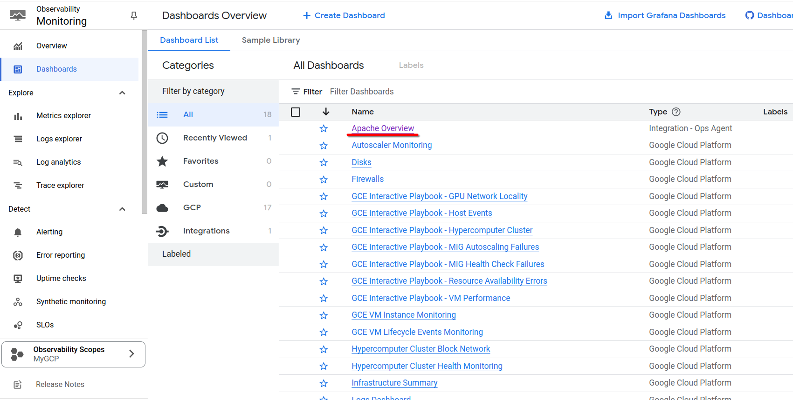
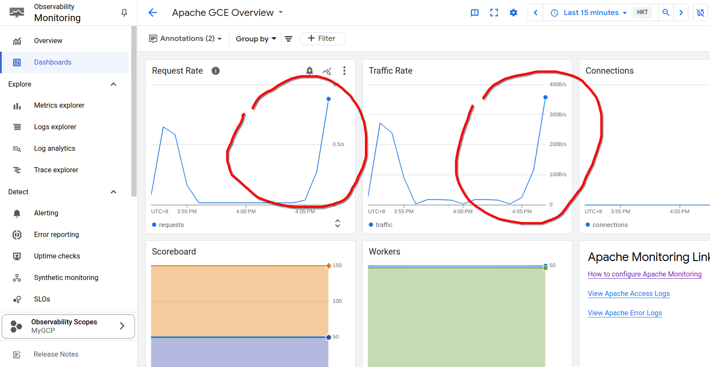
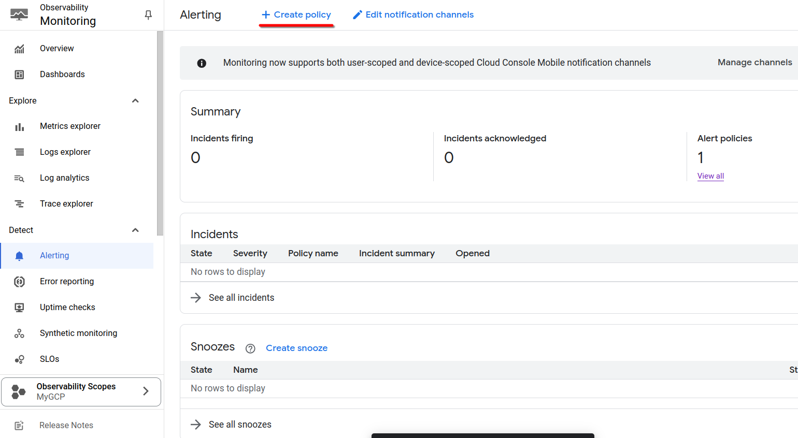
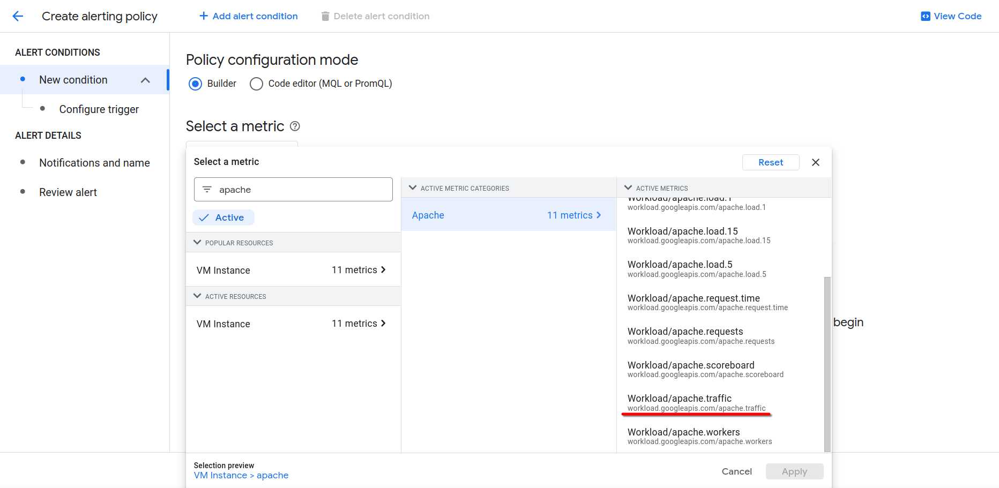
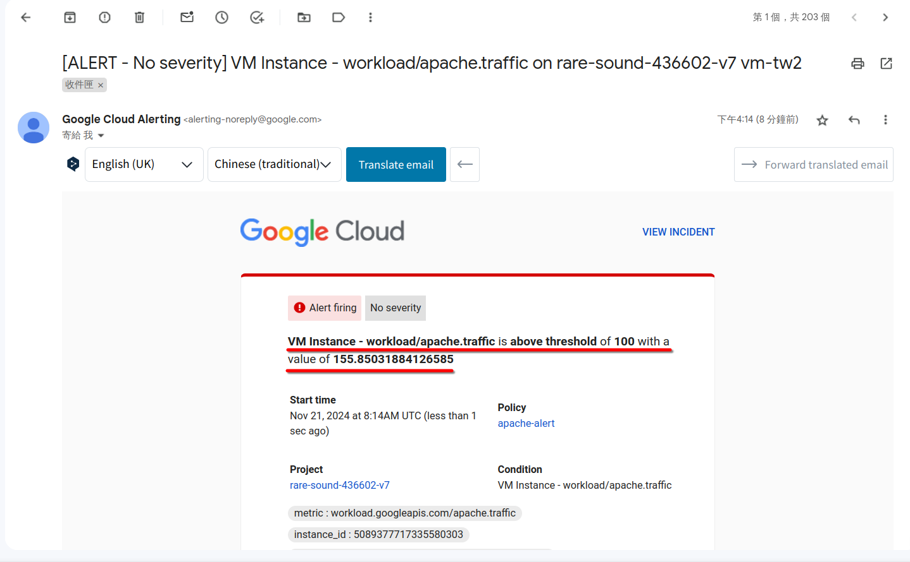
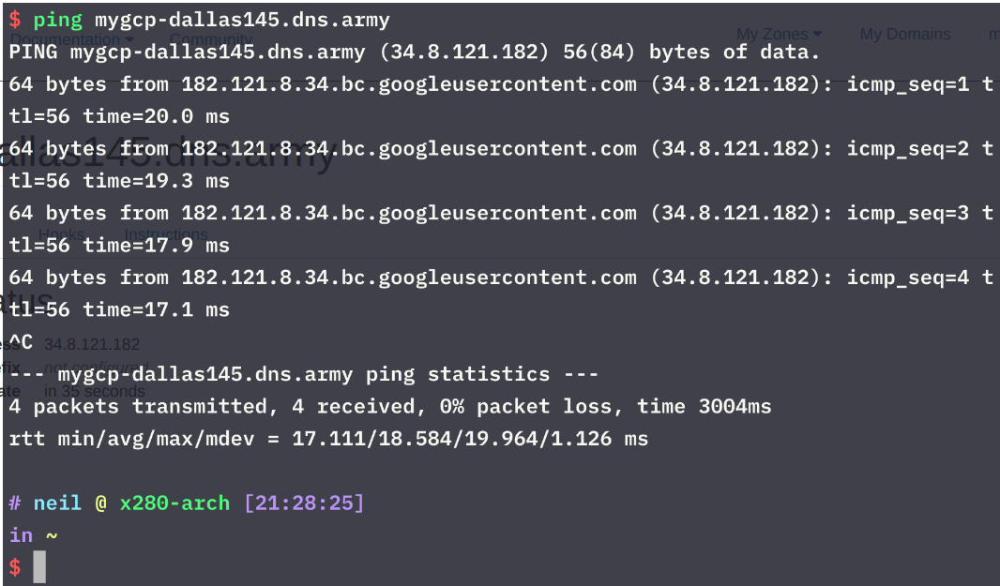
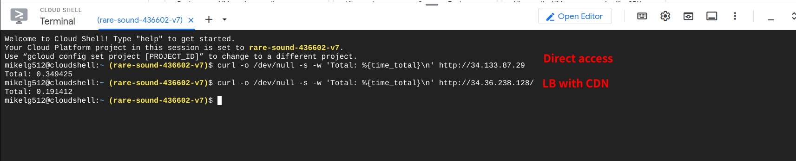

# 第十一週

## Cloud Router
建立一台沒有External IP(Public IP)的虛擬機：<br>
- Name: `vm-no-public-ip`
    - Region: `asia-east1`
    - Machine configuration:
        - Series: `N1`
    - Boot disk:
        - Operating system: `Ubuntu`
        - Version: `Ubuntu 20.04 LTS`
    - Advanced options:
        - Networking:
            - Network interfaces:
            - Network: `default`
                - External IP address: `None`

使用這台虛擬機執行`ping 8.8.8.8`指令，沒辦法成功與Internet通訊。

### 建立Cloud NAT
- Network Services -> Cloud NAT -> Get started
- Gateway name: `default-nat`
    - NAT type: `public`
    - Select Cloud Router:
        - Network: `default`
        - Region: `asia-east1 (Taiwan)`
        - Cloud Router: `CREATE NEW ROUTER`
            - Name: `default-router`
            - `Create`
- `Create`

### 測試
回到虛擬機，再次執行`ping 8.8.8.8`指令，可以ping到`8.8.8.8`，沒有`External IP`但可以與Internet通訊。


## Monitoring & Alerting
**先到`API Library`找到`Config Monitoring for Ops API`並`Enable`。**

建立虛擬機`vm-tw`
- Name: `vm-tw`
    - Region: `asia-east1`
    - Machine configuration:
        - Series: `N1`
    - Boot disk:
        - Operating system: `Ubuntu`
        - Version: `Ubuntu 20.04 LTS`
    - Firewall: `Allow HTTP traffic`
    - Advanced options:
        - Management:
            - Automation:
            - Startup script:
            ```bash
            #!/bin/bash
            apt update
            apt -y install apache2
            cat<<EOF > /var/www/html/index.html
            <html><body><p>Linux startup script added directly. $(hostname -I)</p></body></html>
            ```

點擊虛擬機名稱進入虛擬機詳細頁面，點擊`OBSERVABILITY`，點擊`INSTALL OPS AGENT`。<br>


### Setup Alerting Policy
#### 設定警示方式
Monitoring -> Alerting -> Edit notification channels

找到`Email`，點`Add New`，新增自己的email。

#### 設定Apache伺服器流量監視器
參考：[Collect Apache web server logs and metrics](https://cloud.google.com/monitoring/monitor-compute-engine-virtual-machine?hl=en#install_ops_agent)

依照文檔中的方式執行後，使用指令製造apache伺服器流量，<br>
參考：[Generate traffic](https://cloud.google.com/monitoring/monitor-compute-engine-virtual-machine?hl=en#generate_traffic)

到 Monitoring -> Dashboards -> Apache Overview 查看：<br>
<br>


#### 設定Apache伺服器流量警告
到 Monitoring -> Alerting -> Create policy<br>
<br>
<br>
- Configure alert trigger
    - Condition type: `Threshold`
    - Threshold value: `100 (B/s)`
- Configure notifications and finalize alert
    - Configure notificators: `Use notification channel`（選剛剛新增的Email）
    - Name the alert policy: `apache-alert`
- Create Policy

建立完成後，再次執行至虛擬機執行製造流量的指令，成功收到警告email。<br>


## 伺服器Region與連線速度的關係
### 建立虛擬機`vm-tw`
- Name: `vm-tw`
    - Region: `asia-east1`
    - Machine configuration:
        - Series: `N1`
    - Boot disk:
        - Operating system: `Ubuntu`
        - Version: `Ubuntu 20.04 LTS`
    - Firewall: `Allow HTTP traffic`
    - Advanced options:
        - Management:
            - Automation:
            - Startup script:
            ```bash
            #!/bin/bash
            apt update
            apt -y install apache2
            cat<<EOF > /var/www/html/index.html
            <html><body><p>Linux startup script added directly. $(hostname -I)</p></body></html>
            ```

### 建立虛擬機vm-us
- Name: `vm-us`
    - Region: `us-central1`
    - Machine configuration:
        - Series: `N1`
    - Boot disk:
        - Operating system: `Ubuntu`
        - Version: `Ubuntu 20.04 LTS`
    - Firewall: `Allow HTTP traffic`
    - Advanced options:
        - Management:
            - Automation:
            - Startup script:
            ```bash
            #!/bin/bash
            apt update
            apt -y install apache2
            cat<<EOF > /var/www/html/index.html
            <html><body><p>Linux startup script added directly. $(hostname -I)</p></body></html>
            ```

### 測試連線速度
指令：
```bash
curl -o /dev/null -s -w 'Total: %{time_total}\n' {Server IP}
```

## 使用Load Balancer透過HTTPS連線
### 建立虛擬機vm-tw
- Name: `vm-tw`
    - Region: `asia-east1`
    - Machine configuration:
        - Series: `N1`
    - Boot disk:
        - Operating system: `Ubuntu`
        - Version: `Ubuntu 20.04 LTS`
    - Firewall: `Allow HTTP traffic`
    - Advanced options:
        - Management:
            - Automation:
            - Startup script:
            ```bash
            #!/bin/bash
            apt update
            apt -y install apache2
            cat<<EOF > /var/www/html/index.html
            <html><body><p>Linux startup script added directly. $(hostname -I)</p></body></html>
            ```
### 建立unmanaged instance group
- New unmanaged instance group:
    - Name: `instance-group-1`
    - Region: `asia-east1`
    - Network: `default`
    - VM instances: `vm-tw`

### 在[dynv6.com](dynv6.com)建立免費Domain
Create new Zone:
- Name: `mygcp-dallas145` `(dns.army)`

輸入完domain name先不要按create。

### 建立Load balancer：
- Type of load balancer: `Application Load Balancer (HTTP/HTTPS)`
- Public facing of internal: `Public facing (external)`
- Global of single region deployment: `Best for global workloads`
- Load balancer generation: `Global external Application Load Balancer`
- Configure:
    - Load Balancer name: `mylb`
    - New Frontend IP and port
        - Name: `myfrontend`
        - Protocol: `HTTPS`
        - Certificate: `CREATE A NEW CERTIFICATE`
            - Name: `cert-1`
            - Create mode: `Create Google-managed certificate`
            - Domains: `mygcp-dallas145.dns.army` 
            - `CREATE`
    - Create backend service
        - Name: `mybackend`
        - Instance group: `instance-group-1` 
        - Port number: `80`
        - Uncheck Cloud CDN
            - Create new Healthcheck:
            - Name: `myhealthcheck`
            - `SAVE`
    - `CREATE`
- `CREATE`

建立完成後，把Load balancer的IP輸入到剛建立domain name的網頁的IPv4欄位。

### 確認domain name是否正常


## Cloud CDN (Content Delivery Network)
### 建立虛擬機vm-us
- Name: `vm-us`
    - Region: `us-central1`
    - Machine configuration:
        - Series: `N1`
    - Boot disk:
        - Operating system: `Ubuntu`
        - Version: `Ubuntu 20.04 LTS`
    - Firewall: `Allow HTTP traffic`
    - Advanced options:
        - Management:
            - Automation:
            - Startup script:
            ```bash
            #!/bin/bash
            apt update
            apt -y install apache2
            cat<<EOF > /var/www/html/index.html
            <html><body><p>Linux startup script added directly. $(hostname -I)</p></body></html>
            ```

### 建立unmanaged instance group
- New unmanaged instance group:
    - Name: `instance-group-2`
    - Region: `us-central1`
    - Network: `default`
    - VM instances: `vm-us`

### 建立Load balancer：
- Type of load balancer: `Application Load Balancer (HTTP/HTTPS)`
- Public facing of internal: `Public facing (external)`
- Global of single region deployment: `Best for global workloads`
- Load balancer generation: `Classic Application Load Balancer`
- Configure:
    - Load Balancer name: `mylb2`
    - New Frontend IP and port
        - Name: `myfrontend`
        - Protocol: `HTTP`
        - `DONE`
    - Create backend service
        - Name: `mybackend2`
        - Instance group: `instance-group-2` 
        - Port number: `80`
        - Checked Cloud CDN
            - Create new Healthcheck:
            - Name: `myhealthcheck2`
            - `SAVE`
    - `CREATE`
- `CREATE`

### 測試直接連線與透過Load Balancer winth CDN的連線速度

