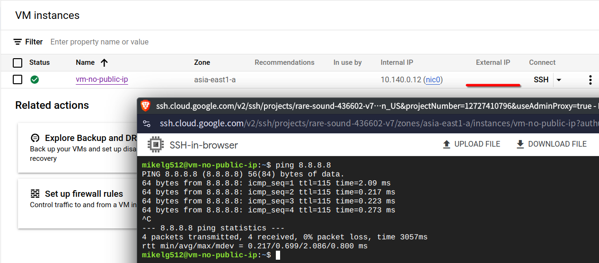
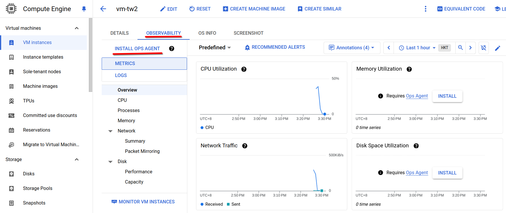

# 第十一週

## Cloud Router
建立一台沒有External IP(Public IP)的虛擬機：<br>
- Name: `vm-no-public-ip`
    - Region: `asia-east1`
    - Machine configuration:
        - Series: `N1`
    - Boot disk:
        - Operating system: `Ubuntu`
        - Version: `Ubuntu 20.04 LTS`
    - Advanced options:
        - Networking:
            - Network interfaces:
            - Network: `default`
                - External IP address: `None`

使用這台虛擬機執行`ping 8.8.8.8`指令，沒辦法成功與Internet通訊。

### 建立Cloud NAT
- Network Services -> Cloud NAT -> Get started
- Gateway name: `default-nat`
    - NAT type: `public`
    - Select Cloud Router:
        - Network: `default`
        - Region: `asia-east1 (Taiwan)`
        - Cloud Router: `CREATE NEW ROUTER`
            - Name: `default-router`
            - `Create`
- `Create`

### 測試
回到虛擬機，再次執行`ping 8.8.8.8`指令，可以ping到`8.8.8.8`，沒有`External IP`但可以與Internet通訊。



## Monitoring & Alerting
**先到`API Library`找到`Config Monitoring for Ops API`並`Enable`。**

建立虛擬機`vm-tw`
- Name: `vm-no-public-ip`
    - Region: `asia-east1`
    - Machine configuration:
        - Series: `N1`
    - Boot disk:
        - Operating system: `Ubuntu`
        - Version: `Ubuntu 20.04 LTS`
    - Firewall: `Allow HTTP traffic`
    - Advanced options:
        - Management:
            - Automation:
            - Startup script:
            ```bash
            #!/bin/bash
            apt update
            apt -y install apache2
            cat<<EOF > /var/www/html/index.html
            <html><body><p>Linux startup script added directly. $(hostname -I)</p></body></html>
            ```

點擊虛擬機名稱進入虛擬機詳細頁面，點擊`OBSERVABILITY`，點擊`INSTALL OPS AGENT`。<br>


### Setup Alerting Policy
#### 設定警示方式
Monitoring -> Alerting -> Edit notification channels

找到`Email`，點`Add New`，新增自己的email。

#### 設定Apache伺服器流量警示
參考：[Collect Apache web server logs and metrics](https://cloud.google.com/monitoring/monitor-compute-engine-virtual-machine?hl=en#install_ops_agent)

依照文檔中的方式執行後，使用指令製造apache伺服器流量，<br>
參考：[Generate traffic](https://cloud.google.com/monitoring/monitor-compute-engine-virtual-machine?hl=en#generate_traffic)
