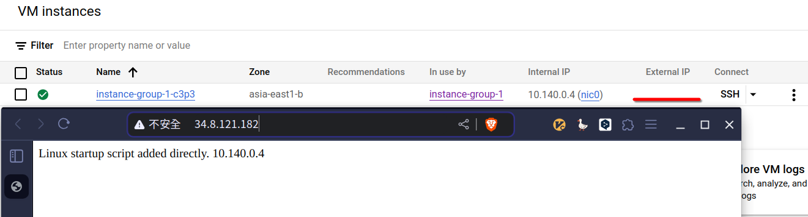
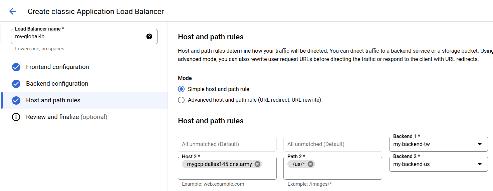
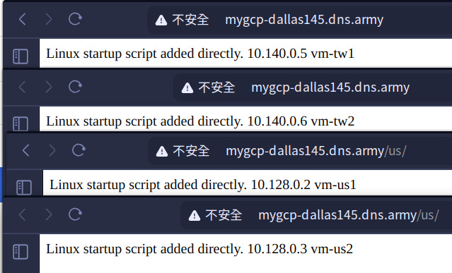
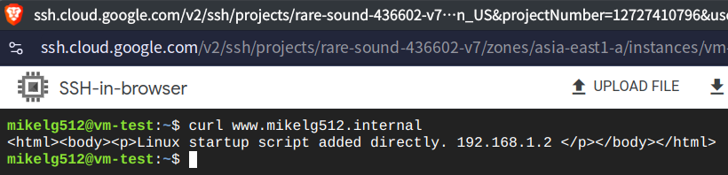

# 第十二週

## 實驗
建立沒有Externl IP的VM，用Managed Load Balancer連線。

### 實作
1. 建立VPC：`myvpc1`
    - Name: `myvpc1`
    - Subnet creation mode: `Custom`
    - Firewall rules:
        - `allow-icmp`
        - `allow-ssh`

2. 建立Firewall rule
    - Name: `myvpc1-allow-healthcheck`
        - Network: `myvpc1`
        - Targets: `Specified target tags`
        - Target tags: `hc`
        - Source filter: `IPv4 ranges`
        - Source IPv4 ranges: `35.191.0.0/16`, `130.211.0.0/22` ([Google Cloud Docs](https://cloud.google.com/load-balancing/docs/health-check-concepts#ip-ranges))
        - Protocols and ports:
            - TCP: `80`

3. 建立Cloud NAT
    - Network Services -> Cloud NAT
    - Gateway name: `myvpc1-nat`
    - NAT type: `public`
    - Select Cloud Router
        - Network: `myvpc1`
        - Region: `asia-east1 (Taiwan)`
        - Cloud Router: `CREATE CLOUD ROUTER`
            - Name: `myvpc1-router`
    - Create

4. 建立Instance template
    - Name: `instance-template-1`
    - Location: `Regional`
    - Region: `asia-east1 (Taiwan)`
    - Machine configuration: `N1`
    - Boot disk:
        - Operating system: `Ubuntu`
        - Version: `Ubuntu 20.04 LTS`
    - Firewall:
        - `Allow HTTP traffic`
        - `Allow Load Balancer Healthchecks`
    - Advanced options:
        - Network tag: `hc`
        - Network interface: `myvpc1`
            - External IP address: `none`
        - Management
            - Startup script:
                ```bash
                #!/bin/bash
                apt update
                apt -y install apache2
                cat<<EOF > /var/www/html/index.html
                <html><body><p>Linux startup script added directly. $(hostname -I)</p></body></html>
                ```

5. 建立Instance group
    - New managed instance group
    - Name: `instance-group-1`
    - Instance template: `instance-template-1`
    - Location: `Singal zone`
        - Region: `asia-east1 (Taiwan)`
        - Zone: `asia-east1-b`
    - Autoscaling:
        - Autoscaling mode: `on`
        - Minimum number of instances: `1`
        - Maximum number of instances: `3`
    - Health check: `instance-group-hc`
    - CREATE

6. 建立Load Balancer
    - Type of load balancer: `Application Load Balancer (HTTP/HTTPS)`
    - Public facing of internal: `Public facing (external)`
    - Global of single region deployment: `Best for global workloads`
    - Load balancer generation: `Classic Application Load Balancer`
    - Configure:
        - Name: `my-managed-lb`
        - New Frontend IP and port
            - Name: `myfrontend`
        - Create backend service
            - Name: `mybackend`
            - instance group: `instance-group-1`
            - port number: `80`
            - Not Enable Cloud CDN
            - Create Healthcheck
                - Name: `lb-healthcheck`
        - CREATE

### 結果


## Cloud Armor
免費帳號沒辦法用。

## 進階負載均衡器
用單一IP或Domain name進行多region的負載均衡


### 建立vm-tw1和vm-tw2
- Name: `vm-tw1` and `vm-tw2`
    - Region: `asia-east1`
    - Zone: `asia-east1-a`
    - Machine configuration:
        - Series: `N1`
    - Boot disk:
        - Operating system: `Ubuntu`
        - Version: `Ubuntu 20.04 LTS`
    - Firewall: `Allow HTTP traffic`
    - Advanced options:
        - Network interface: `myvpc1`
            - External IP address: `none`
        - Management:
            - Automation:
            - Startup script:
            ```bash
            #!/bin/bash
            apt update
            apt -y install apache2
            cat<<EOF > /var/www/html/index.html
            <html><body><p>Linux startup script added directly. $(hostname -I) $(hostname)</p></body></html>
            ```

### 建立Cloud NAT for US
    - Network Services -> Cloud NAT
    - Gateway name: `myvpc1-nat-us`
    - NAT type: `public`
    - Select Cloud Router
        - Network: `myvpc1`
        - Region: `us-central1 (Iowa)`
        - Cloud Router: `CREATE CLOUD ROUTER`
            - Name: `myvpc1-router-us`
    - Create

### 建立vm-us1和vm-us2
- Name: `vm-us1` and `vm-us2`
    - Region: `us-central1`
    - Zone: `us-central1-a`
    - Machine configuration:
        - Series: `N1`
    - Boot disk:
        - Operating system: `Ubuntu`
        - Version: `Ubuntu 20.04 LTS`
    - Firewall: `Allow HTTP traffic`
    - Advanced options:
        - Network interface: `myvpc1`
            - External IP address: `none`
        - Management:
            - Automation:
            - Startup script:
            ```bash
            #!/bin/bash
            apt update
            apt -y install apache2
            cat<<EOF > /var/www/html/index.html
            <html><body><p>Linux startup script added directly. $(hostname -I) $(hostname)</p></body></html>
            ```

### 建立instance-group-tw和instance-group-us
- New Unmanaged Instance Group
    - Name: `instance-group-tw`
    - Region: `asia-east1`
    - Zone: `asia-east1-a`
    - Network: `myvpc1`
    - VMs: `vm-tw1`, `vm-tw2`

- New Unmanaged Instance Group
    - Name: `instance-group-us`
    - Region: `us-central1`
    - Zone: `us-central1-a`
    - Network: `myvpc1`
    - VMs: `vm-us1`, `vm-us2`

### 建立Load Balancer
- Type of load balancer: `Application Load Balancer (HTTP/HTTPS)`
- Public facing of internal: `Public facing (external)`
- Global of single region deployment: `Best for global workloads`
- Load balancer generation: `Classic Application Load Balancer`
- Configure:
    - Name: `my-global-lb`
    - New Frontend IP and port
        - Name: `myfrontend`
    - Create backend service
        - Name: `my-backend-tw`
        - instance group: `instance-group-tw`
        - port number: `80`
        - Enable Cloud CDN
        - Healthcheck: `lb-healthcheck`
    - Create backend service
        - Name: `my-backend-us`
        - instance group: `instance-group-us`
        - port number: `80`
        - Enable Cloud CDN
        - Healthcheck: `lb-healthcheck`
    - Host and path rules:
        

### 移動vm-us的index.html
用ssh連上vm-us1和vm-us2：

```bash
cd /var/www/html
sudo mkdir us
sudo cp index.html us/
```

### 結果


## Internal Load Balancer & Cloud DNS
### 建立myvpc2
- Name: `myvpc2`
- Subnet creation mode: `Custom`
- Subnets:
    - Name: `subnet-1`
        - Region: `asia-east1`
        - IPv4 range: `192.168.1.0/24`
    - Name: `subnet-2`
        - Region: `asia-east1`
        - IPv4 range: `192.168.2.0/24`
- Firewall rules:
    - `allow-icmp`
    - `allow-ssh`

### 新增Firewall rule
- Name: `myvpc2-allow-http`
- Network: `myvpc2`
- Targets: `All instances in the network`
- Source IPv4 ranges: `0.0.0.0/0`
- TCP: `80`

### 設定Cloud NAT
- Gateway name: `myvpc2-nat`
- NAT type: `Public`
- Network: `myvpc2`
- Region: `asia-east1`
- Cloud Router: 
    - Name: `myvpc2-router`

### 建立vm
- Name: `vm`
    - Region: `asia-east1`
    - Machine configuration:
        - Series: `N1`
    - Boot disk:
        - Operating system: `Ubuntu`
        - Version: `Ubuntu 20.04 LTS`
    - Firewall: `Allow HTTP traffic`
    - Advanced options:
        - Network interface: `myvpc2`
            - Subnetwork: `subnet-1`
            - External IP address: `none`
        - Management:
            - Automation:
            - Startup script:
            ```bash
            #!/bin/bash
            apt update
            apt -y install apache2
            cat<<EOF > /var/www/html/index.html
            <html><body><p>Linux startup script added directly. $(hostname -I) $(hostname)</p></body></html>
            ```

### 建立vm-test
- Name: `vm-test`
    - Region: `asia-east1`
    - Machine configuration:
        - Series: `N1`
    - Boot disk:
        - Operating system: `Ubuntu`
        - Version: `Ubuntu 20.04 LTS`
    - Advanced options:
        - Network interface: `myvpc2`
            - Subnetwork: `subnet-2`

### 建立instance group
- Unmanaged Instance Group
- Name: `instance-group-2`
- Region: `asia-east1`
- Network: `myvpc2`
- Subnetwork: `subnet-1`
- VMs: `vm`

### 建立Load Balancer
- Type of load balancer: `Application Load Balancer (HTTP/HTTPS)`
- Public facing of internal: `Internal`
- Cross-region of single region deployment: `Best for regional workloads`
- Configure
    - Name: `mylb`
    - Region: `asia-east1`
    - Network: `myvpc2`
    - Create backend service
        - Name: `mybackend`
        - instance group: `instance-group-2`
        - port number: `80`
        - Create  healthcheck
            - Name: `myhealthcheck`
        - CREATE
    - Frontend configuration
        - Subnet: `subnet-1`

### 記下Load Balancer的IP

### 建立Cloud DNS
- Create a DNS zone
- Zone type: `private`
- Zone name: `mikelg512-internal`
- DNS name: `mikelg512.internal`
- ADD NETWORKS
    - Networks: `myvpc2`
- CREATE

### ADD STANDARD
- DNS name: `www.mikelg512.internal`
- Resource record type: `A`
- IPv4 address: `{load balancer IP}`

### 測試
在vm-test使用`curl`存取vm


