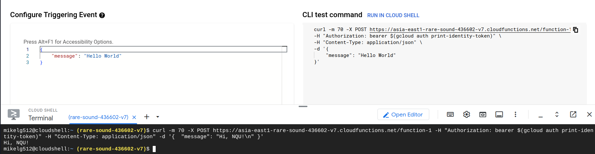
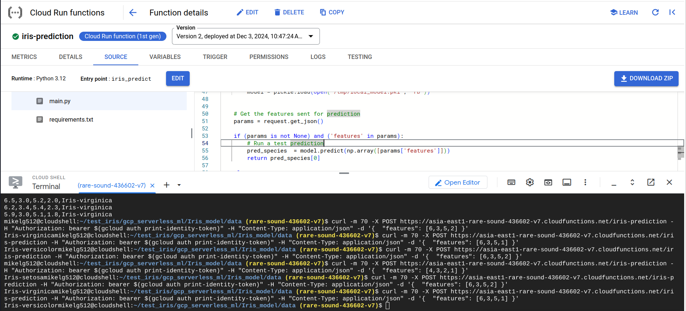
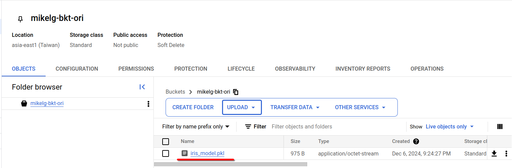

# 第十三週

## Cloud Run Function

### Function-1 (Hello world)
* Create function
    - Basics
        - Environment: `Cloud Run function (1st gen)`
        - Function name: `function-1`
        - Region: `asia-east1 (Taiwan)`
    - Trigger
        - Trigger type: `HTTP`
        - Authentication: `Allow unauthentication invocations`
        - Require HTTPS
    - Save
    - Next
* Code
    - Runtime: `Python 3.12`

直接按`DEPLOY`，測試範例程式。<br>
成功部署後，點擊`TESTING`進入測試頁面，點擊`RUN IN CLOUD SHELL`，在Cloud Shell出現後，按Enter執行指令。


### Function-2 (Machine Learning Model as a Serverless Endpoint using Google Cloud Functions)
參考資料：[Machine Learning Model as a Serverless Endpoint using Google Cloud Functions](https://towardsdatascience.com/machine-learning-model-as-a-serverless-endpoint-using-google-cloud-function-a5ad1080a59e) Member-Only, I can't read it. (Sad😢<br>
使用程式：[GitHub - saedhussain/gcp_serverless_ml: Productionization of machine learning models as serverless solutions on GCP](https://github.com/saedhussain/gcp_serverless_ml)

1. 開啟Cloud Shell，使用以下指令建立資料夾，並在其中clone所需程式碼。
```bash
mkdir test_iris
cd test_iris
git clone https://github.com/saedhussain/gcp_serverless_ml.git
```
2. 進入`gcp_serverless_ml`，進入`Iris_model`，編輯`create_iris_model.py`，將第34行改為`pickle.dump(model, open("iris_model.pkl", "wb"))`
```bash
cd gcp_serverless_ml/Iris_model
vim create_iris_model.py
# 34Gci"iris_model.pkl<c-[>:wq
```
3. 安裝必要套件
```bash
pip install numpy pandas scikit-learn
```
4. 執行`create_iris_model.py`
```bash
python create_iris_model.py
```
5. 下載產生的`iris_model.pkl`檔案，點擊Cloud Shell的`More -> Download`，輸入檔案的絕對路徑，如`/home/mikelg512/test_iris/gcp_serverless_ml/Iris_model/iris_model.pkl`
6. 到Cloud Storage建立一個Bucket，將`iris_model.pkl`上傳。
    - Name: `my-iris-pkl`
    - Region: Single Region: `asia-east1 (Taiwan)`
    - `CREATE`

    建立完成後，點擊`UPLOAD`，上傳檔案。
7. 回到Cloud Run Function建立新的Function
* Create function
    - Basics
        - Environment: `Cloud Run function (1st gen)`
        - Function name: `function-1`
        - Region: `asia-east1 (Taiwan)`
    - Trigger
        - Trigger type: `HTTP`
        - Authentication: `Allow unauthentication invocations`
        - Require HTTPS
    - Save
    - Next
* Code
    - Runtime: `Python 3.12`<br>
    到[main.py](https://github.com/saedhussain/gcp_serverless_ml/blob/main/Iris_http_cloud_func/main.py)複製程式碼並貼上到`main.py`。<br>
    還有複製[requirements.txt](https://github.com/saedhussain/gcp_serverless_ml/blob/main/Iris_http_cloud_func/requirements.txt)貼上到`requierments.txt`<br>
    複製完成後，更改第18、19、20行：<br>
        ```python
        BUCKET_NAME        = "my-iris-pkl"
        PROJECT_ID         = "你的project ID"
        GCS_MODEL_FILE     = "iris_model.pkl"
        ```
        還有將`Entry point`改成`iris_predict`<br>
* 點擊DEPLOY
8. 測試
* 點擊TESTING進行測試，修改左邊的Configure Triggering Event：
    ```
    {
        "features": [2,4,3,4]
    }
    ```

* 點擊右邊的CLI test command右邊的RUN IN CLOUD SHELL，按下Enter

> * \[2,4,3,4]: Iris-Virginica
> * \[3,2,4,1]: Iris-Versicolor
> * \[4,3,2,1]: Iris-Setosa



### 自動偵測上傳到Cloud Storage Bucket的檔案大小並移動Bucket
參考資料：[Move Large Files from GCS bucket using Cloud Function](https://medium.com/google-cloud/move-large-files-from-gcs-bucket-using-cloud-function-232852b10a4c)
1. 建立兩個Bucket
- Name: `mikelg-bkt-ori` <sup>Global unique required</sup>
    - Region: `asia-east1 (Taiwan)`
    - CREATE
- Name: `mikelg-bkt-large`
    - Region: `asia-east1 (Taiwan)`
    - CREATE
2. 建立Cloud function：
* Create function
    - Basics
        - Environment: `Cloud Run function (1st gen)`
        - Function name: `move-files`
        - Region: `asia-east1 (Taiwan)`
    - Trigger
        - Trigger type: `Cloud Storage`
        - Event type: `On (finalizing/creating) file in the selected bucket`
        - Bucket: `mikelg-bkt-ori`
    - Next
* Code
    - Runtime: `python 3.12`
    - requirement.txt:
        ```
        functions-framework==3.*
        google-cloud-storage
        google-cloud
        ```
    - main.py:<br>
        ```python
        import functions_framework
        from google.cloud import storage
        from google.cloud.storage import Blob

        # Triggered by a change in a storage bucket
        @functions_framework.cloud_event
        def hello_gcs(cloud_event):

            data = cloud_event.data

            event_id = cloud_event["id"]
            event_type = cloud_event["type"]

            bucket = data["bucket"]
            name = data["name"]
            metageneration = data["metageneration"]
            timeCreated = data["timeCreated"]
            updated = data["updated"]
            
            print("="*30)
            print(f"Event ID: {event_id}")
            print(f"Event type: {event_type}")
            print(f"Bucket: {bucket}")
            print(f"File: {name}")
            print(f"Metageneration: {metageneration}")
            print(f"Created: {timeCreated}")
            print(f"Updated: {updated}")
            print(f"Processing file: {name}.")
            storage_client = storage.Client(project='rare-sound-436602-v7') # 自己的project ID
            source_bucket=storage_client.get_bucket('mikelg-bkt-ori')       # 自己的bkt-ori
            destination_bucket=storage_client.get_bucket('mikelg-bkt-large')# 自己的bkt-large 
            blobs=list(source_bucket.list_blobs(prefix=''))
            print(blobs)
            for blob in blobs:
                if blob.size > 1000000 and blob.name == name:
                    source_blob = source_bucket.blob(blob.name)
                    new_blob = source_bucket.copy_blob(source_blob, destination_bucket, blob.name) 
                    blob.delete(if_generation_match=None)
                    print(f'File moved from {source_blob} to {new_blob}')
                else:
                    print("File size is below 1MB")
        ```

        * 記得改30到32行

    * DEPLOY

3. 測試
* 上傳`iris_model.pkl`到bkt-ori
    
