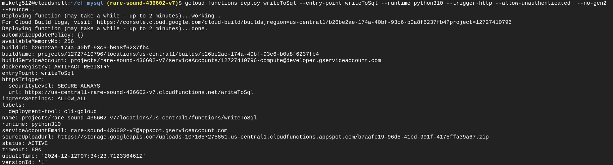
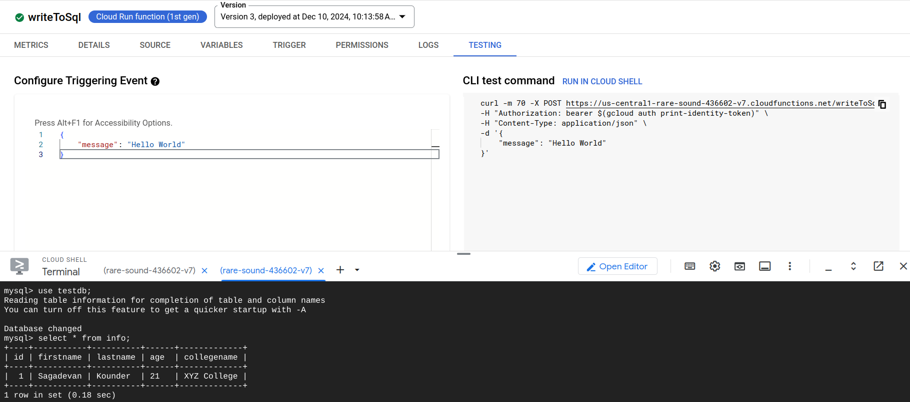
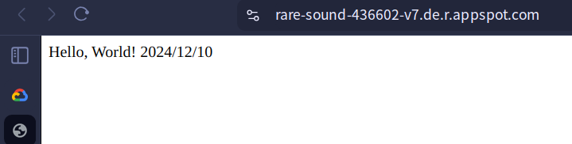

# 第十四週

## Connecting to Cloud SQL with Cloud Functions using CLI（接續上週）

1. 使用指令建立新資料庫`testdb`
```bash
gcloud sql databases create testdb --instance=mydb -i mydb
```

2. 連上資料庫 （密碼是`admin1234`）
```bash
gcloud sql connect mydb --user=root
```

3. 資料庫操作
    1. 檢查`testdb`是否成功建立
    ```sql
    show databases;
    ```

    2. 切換到`testdb`
    ```sql
    use testdb;
    ```

    3. 建立資料表`info`
    ```sql
    CREATE TABLE `info` (
    `id` INT NOT NULL AUTO_INCREMENT,
    `firstname` VARCHAR(20),
    `lastname` VARCHAR(20),
    `age` VARCHAR(3),
    `collegename` VARCHAR(150),
    PRIMARY KEY (`id`)
    );
    ```
4. 開一個新的Cloud Shell分頁並建立資料夾`cf_mysql`
```bash
mkdir cf_mysql
cd cf_mysql
```

5. 建立`~/cf_mysql/main.py`，並貼上以下程式碼
```python
import sqlalchemy
#connection name we noted earlier
#<your project ID>:<the cloud sql instance region>:<cloud sql instance name>
connection_name = "rare-sound-436602-v7:us-central1:mydb"
#database name
db_name = "testdb"
db_user = "root"
db_password = "admin1234"
driver_name = 'mysql+pymysql'
query_string = dict({"unix_socket": "/cloudsql/{}".format(connection_name)})

def writeToSql(request):
   #You can change this to match your personal details
   stmt = sqlalchemy.text("INSERT INTO info ( firstname, lastname, age, collegename) values ('Sagadevan', 'Kounder', '21', 'XYZ College')")

   db = sqlalchemy.create_engine(
   sqlalchemy.engine.url.URL(
   drivername=driver_name,
   username=db_user,
   password=db_password,
   database=db_name,
   query=query_string,
   ),
   pool_size=5,
   max_overflow=2,
   pool_timeout=30,
   pool_recycle=1800
   )
   try:
      with db.connect() as conn:
        conn.execute(stmt)
        print("Insert successful")
   except Exception as e:
      print ("Some exception occured" + e)
      return 'Error: {}'.format(str(e))
   return 'ok'
```

6. 建立`~/cf_mysql/requirements.txt`
```
SQLAlchemy==1.3.12
PyMySQL==0.9.3
```

7. 執行以下指令建立Cloud Function
```bash
gcloud functions deploy writeToSql --entry-point writeToSql --runtime python310 --trigger-http --allow-unauthenticated  --no-gen2 --source .
```


8. 回到Cloud SQL的分頁，執行以下指令檢查資料表`info`
```sql
select * from info
```
應該會顯示：
```
Empty set
```

9. 到GCP的Cloud Run Functions頁面找到剛剛建立的`writeToSql`，點進去，到`TESTING`頁面，複製右邊的`CLI test command`到Cloud Shell執行
```bash
curl -m 70 -X POST https://us-central1-rare-sound-436602-v7.cloudfunctions.net/writeToSql \
-H "Authorization: bearer $(gcloud auth print-identity-token)" \
-H "Content-Type: application/json" \
-d '{
    "message": "Hello World"
}'
```
應該會回傳
```
ok
```

10. 回到Cloud SQL的分頁，再次執行指令檢查資料表`info`
```sql
select * from info
```


11. **做完記得刪掉Cloud SQL和Cloud Function**

## Google App Engine
### Test flask
1. 在Cloud Shell建立`~/test-gae/test-flask/`
```bash
mkdir ~/test-gae && mkdir ~/test-gae/test-flask
cd ~/test-gae/test-flask
```

2. 在`test-flask`中，建立以下三個檔案
    1. `app.yaml`
    ```yaml
    runtime: python39
    service: default
    ```

    2. `main.py`
    ```python
    from flask import Flask
    app = Flask(__name__)

    @app.route("/")
    def hello():
        return "Hello, World! 2024/12/10"

    if __name__ == "__main__":
        app.run(debug=True)
    ```

    3. `requirements.txt`
    ```
    flask
    ```

3. 執行以下指令部署服務
```
gcloud app deploy
```

4. 執行指令檢視服務並點擊網址測試服務
```
gcloud app browse
```


### iris
> tbd (video at 01:16:40)
