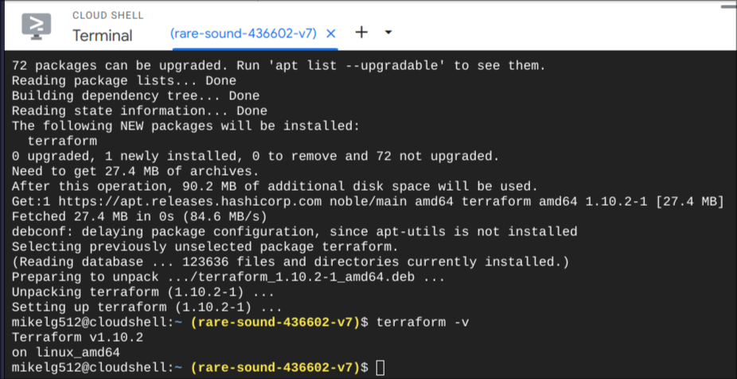
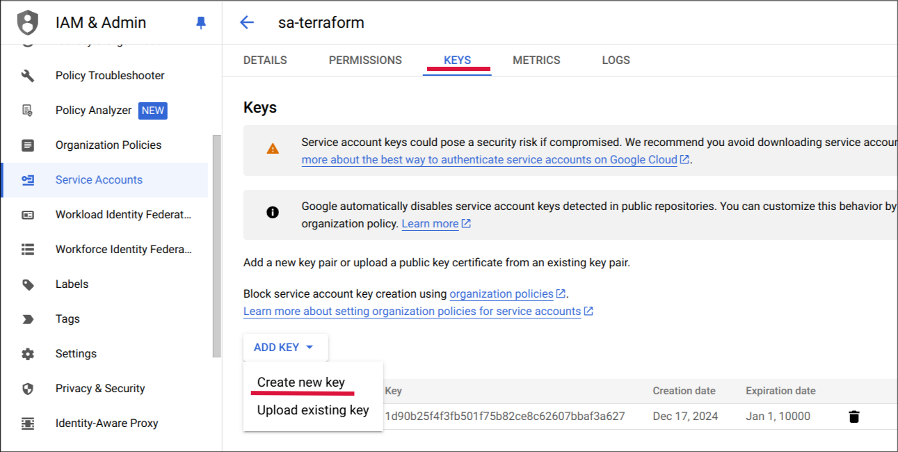
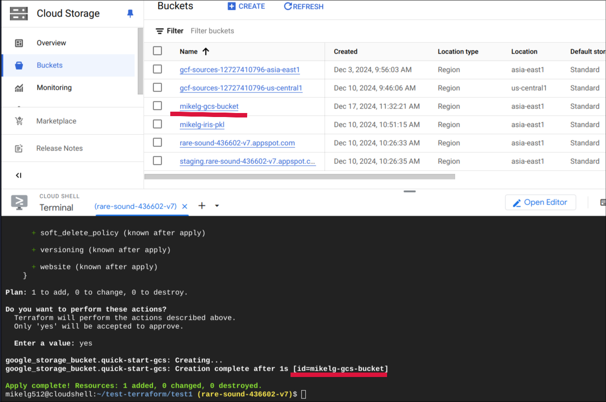
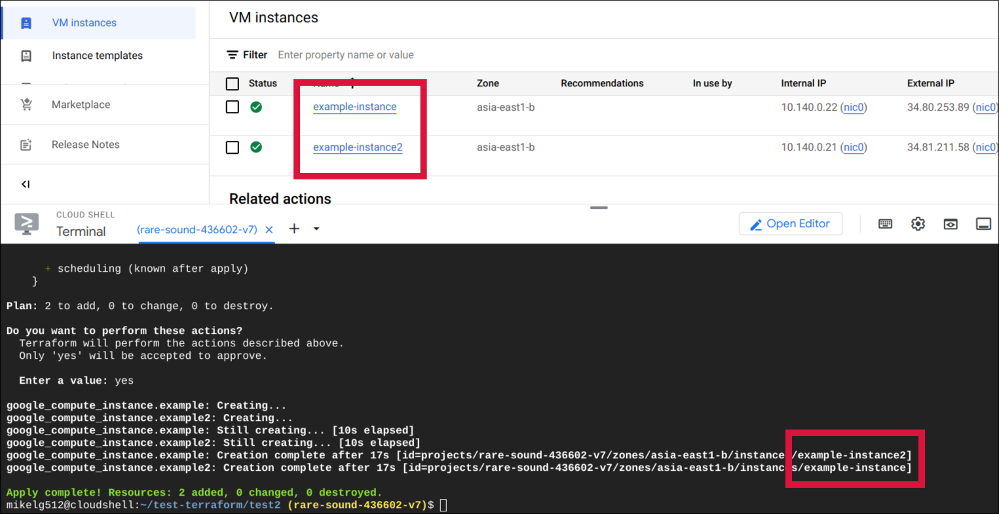

# 第十五週

## Cloud Run

### docker:apache2
1. 建立`~/test-docker`資料夾
```bash
mkdir ~/test-docker
cd ~/test-docker
```

2. 建立`Dockerfile`檔案（D要大寫）
```Dockerfile
FROM ubuntu/apache2:latest
ADD index.html /var/www/html
```

3. 建立`index.html`
```html
hi test
```

4. 建立鏡像
```bash
sudo docker build -t mywww:1.0 .
```

5. 執行鏡像
```bash
sudo docker run -d -p 8080:80 mywww:1.0
```
6. 測試是否建立成功<br>
點擊Cloud Shell上的`Web Preview`按鈕，選擇`8080` port，成功的話會看到`hi test`


## 建立 Artifact Registry
- Name: `mydocker`
- Format: `Docker`
- Mode: `Standard`
- Location type: `Region`
- Region: `asia-east1 (Taiwan)`
- `CREATE`

### 將 docker image build 到 Registry
**docker image name 格式：`Registry/Repository/Name`**<br>
Registry 格式：`{Region}-docker.pkg.dev/{Porject ID}`

使用剛建立的 Registry/Repo ：`asia-east1-docker.pkg.dev/rare-sound-436602-v7/mydocker`

重新 build 剛剛的 Dockerfile<br>
```bash
docker build -t asia-east1-docker.pkg.dev/rare-sound-436602-v7/mydocker/mywww:1.0 .
```

將剛 build 好的 image push 上去<br>
```bash
docker push asia-east1-docker.pkg.dev/rare-sound-436602-v7/mydocker/mywww:1.0
```

push 完成後，點進 image 頁面，點擊 `Deploy to Cloud Run`<br>


- Configure
    - Region: `asia-east1 (Taiwan)`
    - Authenticaton: `Allow unauthenticated invocations`
- Container(s), Volumes, Networking, Security:
    - Container port: `80`
- CREATE

點擊 app URL 查看是否成功<br>


**做完就可以刪掉了。**

### iris
1. 建立 `main.py`, `requirements.txt`, `Dockerfile`, `client.py`, `train_model.py`

```python
# main.py

import pickle

from flask import Flask, request, jsonify

app = Flask(__name__)

# Load the model
model = pickle.load(open('model.pkl', 'rb'))
labels = {
  0: "versicolor",
  1: "setosa",
  2: "virginica"
}

@app.route("/", methods=["GET"])
def index():
    """Basic HTML response."""
    body = (
        "<html>"
        "<body style='padding: 10px;'>"
        "<h1>Welcome to my Flask API</h1>"
        "</body>"
        "</html>"
    )
    return body

@app.route('/api', methods=['POST'])
def predict():
    # Get the data from the POST request.
    data = request.get_json(force = True)
    predict = model.predict(data['feature'])
    return jsonify(predict[0].tolist())

if __name__ == '__main__':
    app.run(debug = True, host = '0.0.0.0', port=8080)
```

`requirement.txt`:
```txt
scikit-learn
flask
```

`Dockerfile`
```docker
FROM python:3.9
 
WORKDIR /app
 
ADD . /app
 
RUN pip install -r requirements.txt
 
CMD ["python", "main.py"]

EXPOSE 8080
```

```python
# client.py

# -*- coding: utf-8 -*-
import requests
# Change the value of experience that you want to test
url = 'http://127.0.0.1:8080/api'
feature = [[5.8, 4.0, 1.2, 0.2]]
labels ={
  0: "setosa",
  1: "versicolor",
  2: "virginica"
}

r = requests.post(url,json={'feature': feature})
print(labels[r.json()])
```

```python
# train_model.py

# -*- coding: utf-8 -*-
import pickle
from sklearn import datasets
from sklearn.model_selection import train_test_split
from sklearn import tree

# simple demo for traing and saving model
iris=datasets.load_iris()
x=iris.data
y=iris.target

#labels for iris dataset
labels ={
  0: "setosa",
  1: "versicolor",
  2: "virginica"
}

x_train, x_test, y_train, y_test = train_test_split(x, y, test_size=.25)
classifier=tree.DecisionTreeClassifier()
classifier.fit(x_train,y_train)
predictions=classifier.predict(x_test)

#export the model
model_name = 'model.pkl'
print("finished training and dump the model as {0}".format(model_name))
pickle.dump(classifier, open(model_name,'wb'))
```

2. 在 Cloud Shell 執行 `train_model.py` 產生模型檔：
```bash
python train_model.py
```

3. 在 Cloud Shell 測試 `main.py`
```bash
python main.py
```

開新的 Cloud Shell 分頁，並執行 `client.py`
```bash
python client.py
```

若回傳 `setosa` 表示程式正常運作

4. build docker image & test docker image
```bash
docker build -t myiris:1.0 .
```

```
docker run -d -p 8080:8080 myiris:1.0
```

一樣在新的 Cloud Shell 分頁執行 `client.py`

若回傳 `setosa` 表示程式正常運作

5. 建立新的 repo
- Name: `test-iris`
- Region: `asia-east1 (Taiwan)`
- CREATE

6. 將 docker image build 到 repo 上<br>
build
```bash
docker build -t asia-east1-docker.pkg.dev/rare-sound-436602-v7/test-iris/myiris:1.0 .
```

push
```bash
docker push asia-east1-docker.pkg.dev/rare-sound-436602-v7/test-iris/myiris:1.0
```

7. Deploy to Cloud Run
- Service Name: `myiris`
- Region: `asia-east1 (Taiwan)`
- Authentication: `Allow unauthenticated invocations`
- CREATE

8. Test

將 `client.py` 裡的 `url` 改成 Service 的 URL
```python
url = 'https://myiris-12727410796.asia-east1.run.app'
```

執行 `client.py`
```python
python client.py
```

若回傳 `setosa` 表示成功

## Terraform

參考資料：[Day 4 — Terraform基礎 —  Terraform 簡介與安裝 - 從零開始精通DevOps與雲端技術](https://devops-with-alex.com/day-4-terraform-install/)

1. 安裝
```bash
wget -O- https://apt.releases.hashicorp.com/gpg | \
sudo gpg --dearmor -o /usr/share/keyrings/hashicorp-archive-keyring.gpg && \
echo "deb [signed-by=/usr/share/keyrings/hashicorp-archive-keyring.gpg] \
https://apt.releases.hashicorp.com $(lsb_release -cs) main" | \
sudo tee /etc/apt/sources.list.d/hashicorp.list && \ 
sudo apt update && sudo apt install terraform
```



2. Create a Service Account for Terraform
- Service Account Name: `sa-terraform`
- Create and Continue
- Role: `Owner` **實務上不應使用**
- Continue
- Done

點進剛建立的 `sa-terraform` ，點擊 `ADD KEY -> Create new key`



格式選擇 `JSON` ，下載後將檔案上傳至 Cloud Shell ，並將其改成較簡單的檔名，如 `mySA.json`

### Terraform 範例1
1. 建立 `test-terraform/test1` 資料夾，在裡面建立 `main.tf` ，並複製一份 `mySA.json` 到裡面
```terraform
provider "google" {
  credentials = file("mySA.json")
  project     = "rare-sound-436602-v7"
  region      = "asia-east1"
}

resource "google_storage_bucket" "quick-start-gcs" {
  name          = "mikelg-gcs-bucket"
  location      = "asia-east1"
  force_destroy = true
}
```

其中 `project` 要使用自己的 Project ID ， `gcs-bucket` 的名字要 Global Unique

2. 初始化
```bash
terraform init
```

**可使用 `terraform fmt` 自動修正 terraform 檔案的格式**

**可使用 `terraform validate` 偵測 terraform 檔案是否合格**

**可使用 `terraform plan` 進行 dry run ，檢查是否可行**

3. 執行
```bash
terraform apply
```

4. 到 Cloud Storage 檢查 Bucket 是否被建立<br>



5. 刪除
```bash
terraform destroy
```

### Terraform 範例2

1. 建立 `test-terraform/test2` 資料夾，在裡面建立 `main.tf` 、 `provider.tf` ，並複製一份 `mySA.json` ，到裡面

```terraform
# provider.tf
##################################################################################
# CONFIGURATION
##################################################################################
terraform {
  # 指定 terraform 的最小版本
  required_version = ">=1.0"

  required_providers {
    # provider 中的最小版本
    google = {
      source  = "hashicorp/google"
      version = ">= 4.40.0"
    }
  }
}
##################################################################################
# PROVIDERS
##################################################################################
provider "google" {
  # your project name
  credentials = file("mySA.json")
  project     = "rare-sound-436602-v7"
}
```

```terraform
# main.tf
resource "google_compute_instance" "example2" {
  name         = "example-instance"
  machine_type = "e2-micro"
  zone         = "asia-east1-b"

  boot_disk {
    initialize_params {
      image = "projects/ubuntu-os-cloud/global/images/ubuntu-2204-jammy-v20240726"
    }
  }

  network_interface {
    network = "default"

    access_config {
      // Ephemeral IP
    }
  }
}

resource "google_compute_instance" "example" {
  name         = "example-instance2"
  machine_type = "e2-micro"
  zone         = "asia-east1-b"

  boot_disk {
    initialize_params {
      image = "projects/ubuntu-os-cloud/global/images/ubuntu-2204-jammy-v20240726"
    }
  }

  network_interface {
    network = "default"

    access_config {
      // Ephemeral IP
    }
  }
}
```

2. 初始化
```bash
terraform init
```

**可使用 `terraform fmt` 自動修正 terraform 檔案的格式**

**可使用 `terraform validate` 偵測 terraform 檔案是否合格**

**可使用 `terraform plan` 進行 dry run ，檢查是否可行**

3. 執行
```bash
terraform apply
```

4. 到 Computer Engine 檢查虛擬機是否被建立<br>


5. 刪除
```bash
terraform destroy
```

### Terraform 範例3

1. 建立 `test-terraform/test3` 資料夾，在裡面建立 `main.tf` ，並複製一份 `mySA.json` 、 `test-terraform/test2provider.tf` 到裡面

```terraform
resource "google_compute_instance" "example" {
  name         = "example-instance"
  machine_type = "e2-micro"
  zone         = "asia-east1-b"

  boot_disk {
    initialize_params {
      image = "projects/ubuntu-os-cloud/global/images/ubuntu-2204-jammy-v20240726"
    }
  }

  network_interface {
    network = "default"

    access_config {
      // Ephemeral IP
    }
  }

  # 成功案例，執行電腦本機路徑
  provisioner "local-exec" {
    command = "echo ${google_compute_instance.example.network_interface[0].network_ip} > ./ip_address_local_exec.txt"
  }

  # # 失敗案例，傳送到虛擬電腦本機
  # provisioner "file" {
  #   content     = google_compute_instance.example.network_interface[0].network_ip
  #   destination = "/tmp/ip_address_file.txt"
  # }

  # # 失敗案例，無法連線到遠端
  # provisioner "remote-exec" {
  #   inline = [
  #     "echo ${google_compute_instance.example.network_interface[0].network_ip} > /tmp/ip_address_remote_exec.txt"
  #   ]
  # }
}
```

2. 初始化
```bash
terraform init
```

**可使用 `terraform fmt` 自動修正 terraform 檔案的格式**

**可使用 `terraform validate` 偵測 terraform 檔案是否合格**

**可使用 `terraform plan` 進行 dry run ，檢查是否可行**

3. 執行
```bash
terraform apply
```

4. 到 Computer Engine 檢查虛擬機是否被建立<br>
