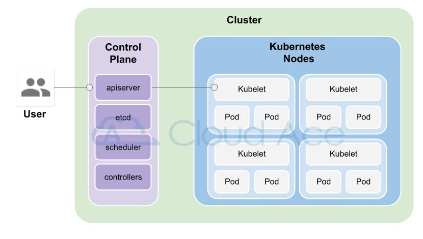
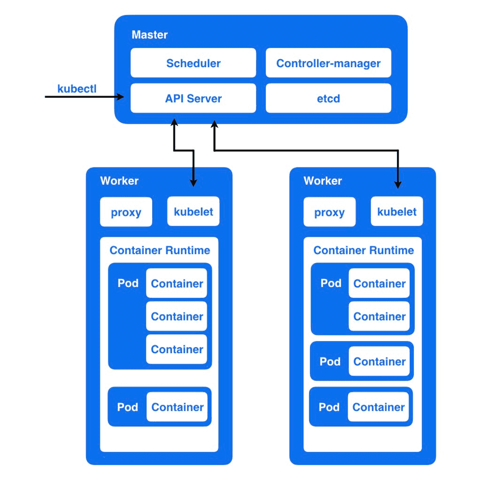
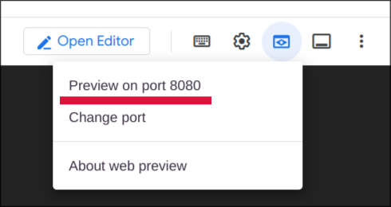
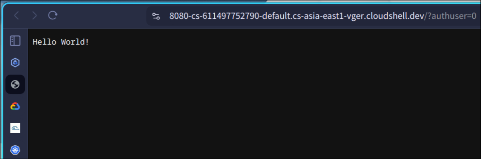
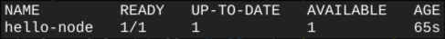
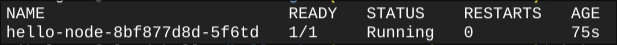
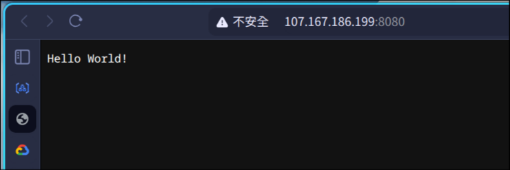
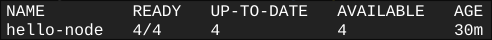
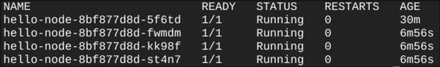
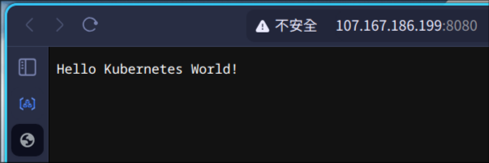

<!--
_class: lead
_paginate: skip
_transition: flip
-->

# 簡單介紹 GKE
## Google Kubernetes Engine

資工四 111010511 蔡松宏

---
<!--
_paginate: skip
transition: cover
-->
# 目錄

1. Kubernetes 簡介
2. GKE 的功能與優勢
3. GKE 簡單實作
---
<!--
_header: Kubernetes 簡介
-->

## Kubernetes 是什麼？


Kubernetes 是 Google 開發的開源系統，用於自動部署、擴展及管理容器化應用程式，提供可彈性運行分散式系統的自動化管理架構，透過集中化的管理介面控管所有節點。服務的<b>自動部署</b>、<b>自動修復</b>、<b>負載均衡</b>，還有<b>服務間的溝通</b>與<b>滾動式更新</b>都可以透過K8s完成。

<!--
_footer: K8s: K到s之間有八個字母
-->

---
<!--
_header: Kubernetes 簡介
-->
## Kubernetes 基本架構


<!--
_footer: 圖片來源：[Kubernetes 是什麼？Docker、K8s、GKE 優勢比較 - Cloud Ace](https://blog.cloud-ace.tw/application-modernization/devops/docker-k8s-gke-intro/#Kubernetes（K8s）是什麼？Docker_容器編排工具)
-->

---
<!--
_header: Kubernetes 簡介
-->
## Kubernetes 基本架構


<!--
_footer: 圖片來源：[Kubernetes 基礎教學（一）原理介紹 | Cheng-Wei Hu](https://chengweihu.com/kubernetes-tutorial-1-pod-node/)
-->

---
<!--
_header: Kubernetes 簡介
transition: push
-->
## Kubernetes 的缺點

<br>1. 建置過程繁瑣
2. Day-2 operations<sup>*</sup> 複雜

<!--
_footer: <sup>*</sup>Day-2 operations: 指建置完成後，為確保系統的穩定性、性能及可持續性所涉及的管理工作。
-->

---

<!--
_header: GKE的功能與優勢
-->
## 什麼是 GKE


GKE 是 Google Cloud 提供的 Kubernetes 代管服務，其核心概念在於藉由 GCP 上的
- 運算資源（GCE）
- UI 界面（GCP console）
- 網路服務（VPC network, Load Balancing etc.）
- 作業套件（Cloud Monitoring & Logging）

等雲端服務來減輕開發人員操作 Kubernetes 的負擔。

---

<!--
_header: GKE的功能與優勢
-->
## GKE 的結構


<!--
_footer: 圖片來源：[GKE cluster architecture  |  Google Kubernetes Engine (GKE)  |  Google Cloud](https://cloud.google.com/kubernetes-engine/docs/concepts/cluster-architecture)
-->

---

<!--
_header: GKE的功能與優勢
transition: slide
-->
## 使用 GKE 的優勢

- 一鍵式快速建立 Kubernetes Cluster (可使用圖形化界面)
- 基於 GCE 建立 Cluster
- 支援 Regional Cluster ，提高Control Plane 和 Node 的可用性
- 支援使用不同 Node pool 提高靈活性
- 軟體自動升級
- 自動擴容
- 自動修復節點
- 結合 Google Cloud Operation Suit (Monitoring and Logging)
- 結合 Cloud Load Balancing

---

<!--
_header: GKE 簡單實作
_class: lead
-->

## Hello Node Kubernetes
### 實做範例

---

<!--
_header: GKE 簡單實作
-->

### 1. 使用 Cloud Shell 建立並進入 `hello-gke` 資料夾
```bash
mkdir hello-gke && cd hello-gke
```

### 2. 建立 `server.js` 檔案並加入以下內容
```js
var http = require('http');
var handleRequest = function(request, response) {
  response.writeHead(200);
  response.end("Hello World!");
}
var www = http.createServer(handleRequest);
www.listen(8080);
``` 

<!--
_footer: 本實驗內容來自：[Hello Node Kubernetes | Google Cloud Skills Boost](https://www.cloudskillsboost.google/focuses/564?parent=catalog)
-->

---

<!--
_header: GKE 簡單實作
-->

### 3. 測試程式
執行 `node` 指令
```bash
node server.js
```
使用 `Cloud Shell` 內建的 `Web Preview` 測試



<!--
_footer: 本實驗內容來自：[Hello Node Kubernetes | Google Cloud Skills Boost](https://www.cloudskillsboost.google/focuses/564?parent=catalog)
-->

---

<!--
_header: GKE 簡單實作
-->

### 3. 測試程式



<!--
_footer: 本實驗內容來自：[Hello Node Kubernetes | Google Cloud Skills Boost](https://www.cloudskillsboost.google/focuses/564?parent=catalog)
-->

---

<!--
_header: GKE 簡單實作
-->

### 4. 建立 Docker image

建立 `Dockerfile` 檔案並加入以下內容
```docker
FROM node:6.9.2
EXPOSE 8080
COPY server.js .
CMD node server.js
```
執行 `build` 指令
```bash
docker build -t gcr.io/YOUR_PROJECT_ID/hello-node:v1 .
```


<!--
_footer: 本實驗內容來自：[Hello Node Kubernetes | Google Cloud Skills Boost](https://www.cloudskillsboost.google/focuses/564?parent=catalog)
-->

---

<!--
_header: GKE 簡單實作
-->

### 5. 測試 Docker image

```bash
docker run -d -p 8080:8080 gcr.io/YOUR_PROJECT_ID/hello-node:v1
```
使用 `Cloud Shell` 內建的 `Web Preview` 測試


<!--
_footer: 本實驗內容來自：[Hello Node Kubernetes | Google Cloud Skills Boost](https://www.cloudskillsboost.google/focuses/564?parent=catalog)
-->

---

<!--
_header: GKE 簡單實作
-->

### 5. 測試 Docker image


<!--
_footer: 本實驗內容來自：[Hello Node Kubernetes | Google Cloud Skills Boost](https://www.cloudskillsboost.google/focuses/564?parent=catalog)
-->

---

<!--
_header: GKE 簡單實作
-->

### 5. 測試 Docker image

停止測試用的 Container

```bash
docker stop CONTAINER_ID
```

`CONTAINER_ID` 可以用 `docker ps` 指令找到


<!--
_footer: 本實驗內容來自：[Hello Node Kubernetes | Google Cloud Skills Boost](https://www.cloudskillsboost.google/focuses/564?parent=catalog)
-->

---

<!--
_header: GKE 簡單實作
-->

### 6. 推送 Docker image

```bash
docker push gcr.io/YOUR_PROJECT_ID/hello-node:v1
```

### 7. 建立 Cluster

先確認佈署的環境在正確的project
```bash
gcloud config set project YOUR_PROJECT_ID
```

<!--
_footer: 本實驗內容來自：[Hello Node Kubernetes | Google Cloud Skills Boost](https://www.cloudskillsboost.google/focuses/564?parent=catalog)
-->

---

<!--
_header: GKE 簡單實作
-->

### 7. 建立 Cluster

建立有兩個`n1-standard-1` node 的 Cluster
```bash
gcloud container clusters create hello-world \
                --num-nodes 2 \
                --machine-type n1-standard-1 \
                --zone asia-east1-a
```

<!--
_footer: 本實驗內容來自：[Hello Node Kubernetes | Google Cloud Skills Boost](https://www.cloudskillsboost.google/focuses/564?parent=catalog)
-->

---

<!--
_header: GKE 簡單實作
-->

### 8. 建立 deployment

```bash
kubectl create deployment hello-node \
    --image=gcr.io/YOUR_PROJECT_ID/hello-node:v1
```

<!--
_footer: 本實驗內容來自：[Hello Node Kubernetes | Google Cloud Skills Boost](https://www.cloudskillsboost.google/focuses/564?parent=catalog)
-->

---

<!--
_header: GKE 簡單實作
-->

### 8. 建立 deployment

查看 deployment
```bash
kubectl get deployments
```

查看 pods
```bash
kubectl get pods
```


<!--
_footer: 本實驗內容來自：[Hello Node Kubernetes | Google Cloud Skills Boost](https://www.cloudskillsboost.google/focuses/564?parent=catalog)
-->

---

<!--
_header: GKE 簡單實作
-->

### 9. Allow external traffic

```bash
kubectl expose deployment hello-node --type="LoadBalancer" --port=8080
```
查看服務的外部IP
```bash
kubectl get services
```
外部IP可能要等幾分鐘才會出現


<!--
_footer: 本實驗內容來自：[Hello Node Kubernetes | Google Cloud Skills Boost](https://www.cloudskillsboost.google/focuses/564?parent=catalog)
-->

---

<!--
_header: GKE 簡單實作
-->

### 9. Allow external traffic

複製外部IP在瀏覽器開啟（8080埠）


<!--
_footer: 本實驗內容來自：[Hello Node Kubernetes | Google Cloud Skills Boost](https://www.cloudskillsboost.google/focuses/564?parent=catalog)
-->

---

<!--
_header: GKE 簡單實作
-->

### 10. 將服務擴容

擴容至4個 pod
```bash
kubectl scale deployment hello-node --replicas=4
```

<!--
_footer: 本實驗內容來自：[Hello Node Kubernetes | Google Cloud Skills Boost](https://www.cloudskillsboost.google/focuses/564?parent=catalog)
-->

---

<!--
_header: GKE 簡單實作
-->

### 10. 將服務擴容

查看 deployment
```bash
kubectl get deployments
```

查看 pods
```bash
kubectl get pods
```


<!--
_footer: 本實驗內容來自：[Hello Node Kubernetes | Google Cloud Skills Boost](https://www.cloudskillsboost.google/focuses/564?parent=catalog)
-->

---

<!--
_header: GKE 簡單實作
-->

### 11. 模擬程式更新

1. 修改 `server.js` 並存檔

```js
var http = require('http');
var handleRequest = function(request, response) {
  response.writeHead(200);
  response.end("Hello Kubernetes World!"); //改這裡，加入'Kubernetes'
}
var www = http.createServer(handleRequest);
www.listen(8080);
``` 


<!--
_footer: 本實驗內容來自：[Hello Node Kubernetes | Google Cloud Skills Boost](https://www.cloudskillsboost.google/focuses/564?parent=catalog)
-->

---

<!--
_header: GKE 簡單實作
-->

### 11. 模擬程式更新

2. 執行 `docker build` （版本改成 v2）
```bash
docker build -t gcr.io/YOUR_PROJECT_ID/hello-node:v2 .
```
3. 推送
```bash
docker push gcr.io/YOUR_PORJECT_ID/hello-node:v2
```

<!--
_footer: 本實驗內容來自：[Hello Node Kubernetes | Google Cloud Skills Boost](https://www.cloudskillsboost.google/focuses/564?parent=catalog)
-->

---

<!--
_header: GKE 簡單實作
-->

### 11. 模擬程式更新

4. 修改 `deployment` （會自動開啟編輯器）
```bash
kubectl edit deployment hello-node
```
5. 在`vim`編輯器中，可使用`/`搜尋`image`快速跳轉到對應行數進行修改
```yml
- image: gcr.io/YOUR_PROJECT_ID/hello-node:v2 # v1 改成 v2
```
6. 存檔退出後，執行 `get` 指令套用
```bash
kubectl get deployments
```

<!--
_footer: 本實驗內容來自：[Hello Node Kubernetes | Google Cloud Skills Boost](https://www.cloudskillsboost.google/focuses/564?parent=catalog)
-->

---

<!--
_header: GKE 簡單實作
transition: wipe
-->

### 11. 模擬程式更新

7. 在瀏覽器打開服務的IP位址查看是否成功<br>（`kubectl get services`）



<!--
_footer: 實作結束
-->

---

## 使用工具

1. [Google Cloud](console.cloud.google.com)
2. [marp-cli](https://github.com/marp-team/marp-cli) <- 簡報製作

<!--
_footer:  I use Arch, BTW.
_paginate: skip
-->

---

<!--
transition: swoosh
-->

## 參考資料
- [基礎架構的未來趨勢 – 容器化技術與Google Kubernetes Engine之介紹 | 思想科技 Master Concept](https://www.hkmci.com/zh-hant/blog/future-trends-infrastructure-container-technology-and-google-kubernetes-engine-introduction/)
- [Day11 - Google Kubernetes Engine(GKE) 輕鬆架起 k8s 環境](https://ithelp.ithome.com.tw/m/articles/10262531)
- [Kubernetes 是什麼？Docker、K8s、GKE 優勢比較 - Cloud Ace](https://blog.cloud-ace.tw/application-modernization/devops/docker-k8s-gke-intro/#Kubernetes（K8s）是什麼？Docker_容器編排工具)
- [代管式 Kubernetes 介紹 - GKE：比 K8s 更好用的 DevOps 工具- Cloud Ace](https://blog.cloud-ace.tw/application-modernization/devops/gke-intro-and-devops-solution/)
- [【K8s 教學】代管式 Kubernetes - GKE 教學實作 6 步驟 - Cloud Ace](https://blog.cloud-ace.tw/application-modernization/devops/google-kubernetes-engine-tutorial-create-a-cluster/)
- [Kubernetes 基礎教學（一）原理介紹 | Cheng-Wei Hu](https://chengweihu.com/kubernetes-tutorial-1-pod-node/)
- [Hello Node Kubernetes | Google Cloud Skills Boost](https://www.cloudskillsboost.google/focuses/564?parent=catalog)

---

<!--
_paginate: skip
_class: lead
_footer:  I use Arch, BTW.
-->

## 報告結束
## 感謝聆聽

**筆記網址： [dallas145/nqucsie2024gcp](https://github.com/dallas145/nqucsie2024gcp)**