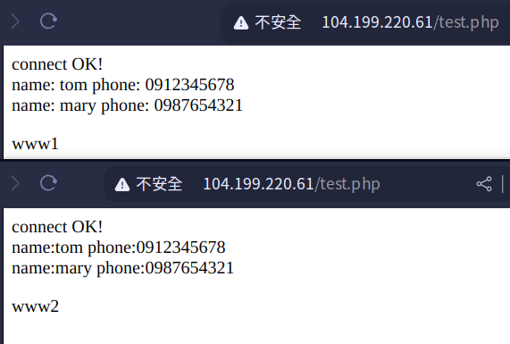

# 期中練習

## 題目：
You need to create two vpc networks, i.e. myvpc1 and myvpc2. In myvpc1 (any zone), create two VMs with http server. In myvpc2, create DB (vm or cloud sql). make http servers connect to DB. Also add one load balancer. If a customer connect to LB, LB will dispatch the traffic to the backend http server.<br>


## 作法：
1. 建立兩個VPC network：
    1. Name: `myvpc1`
        - Subnet creation mode: `custom`
            - Subnet name: `asia-east1`
            - Subnet IPv4 range: `10.10.0.0/24`
        - Firewall rules:
            - myvpc1-allow-icmp
            - myvpc1-allow-ssh
    2. Name: `myvpc2`
        - Subnet creation mode: `custom`
            - Subnet name: `asia-east2`
            - Subnet IPv4 range: `10.20.0.0/24`
        - Firewall rules:
            - myvpc2-allow-icmp
            - myvpc2-allow-ssh
            - 額外新增規則：myvpc2-allow-3306
                - allow `TCP:3306`
2. 建立VPC peering：
    1. Name: `myvpc1-myvpc2`
        - Your VPC network: `myvpc1`
        - VPC network name: `myvpc2`
    2. Name: `myvpc2-myvpc1`
        - Your VPC network: `myvpc2`
        - VPC network name: `myvpc1`
3. 建立3台虛擬機：
    1. Name: `www1`
        - Region: `asia-east1 (Taiwan)`
        - Machine configuration: `N1`
        - OS: `Ubuntu 20.04 LTS`
        - Firewall: `Allow HTTP traffic`
        - Advanced options -> Network interfaces: `myvpc1`
        - Advanced options -> Management: Automation
            ```bash
            #!/bin/bash
            apt update
            apt -y install apache2
            cat <<EOF > /var/www/html/index.html
            <html><body><p>Linux startup script added directly. $(hostname -I)</p></body></html>
            ```
    2. Name: `www2`
        - Region: `asia-east1 (Taiwan)`
        - Machine configuration: `N1`
        - OS: `Ubuntu 20.04 LTS`
        - Firewall: `Allow HTTP traffic`
        - Advanced options -> Network interfaces: `myvpc1`
        - Advanced options -> Management: Automation
            ```bash
            #!/bin/bash
            apt update
            apt -y install apache2
            cat <<EOF > /var/www/html/index.html
            <html><body><p>Linux startup script added directly. $(hostname -I)</p></body></html>
            ```
    3. Name: `mydb`
        - Region: `asia-east1 (Taiwan)`
        - Machine configuration: `N1`
        - OS: `Ubuntu 20.04 LTS`
        - Advanced options -> Network interfaces: `myvpc2`
4. 在`mydb`安裝`mariadb`
    1. 安裝：<br>
        ```bash
        sudo apt install mariadb-server
        ```
    2. 啟動：<br>
        ```bash
        sudo systemctl start mariadb
        ```
    3. 設定：<br>
        ```bash
        sudo mysql_secure_installation
        ```
        ```
        Enter current password for root (Enter for none): Enter
        Change the root password? [Y/n]: y
        New password: 123456
        Re-enter new password: 123456
        Remove anonymous users? [Y/n]: y
        Disallow root login remotly? [Y/n]: n
        Remove test database and access to it? [Y/n]: y
        Reload privilege tables now? [Y/n]: y
        ```
    4. 測試登入mysql並新增資料庫：<br>
        ```bash
        sudo mysql -uroot -p
        ```
        設定資料庫權限<br>
        ```sql
        GRANT ALL PRIVILEGES ON *.* TO 'root'@'%' IDENTIFIED BY '123456' WITH GRANT OPTION;
        FLUSH PRIVILEGES;
        ```
        建立資料庫<br>
        ```sql
        CREATE DATABASE testdb;
        USE testdb;
        CREATE TABLE addrbook(name varchar(50) not null, phone var(10));
        INSERT INTO addrbook(name, phone) values("tom", "0987654321");
        INSERT INTO addrbook(name, phone) values("mary", "0912345678");
        SELECT * FROM addrbook;
        ```
    5. 編輯`mariadb`配置檔：<br>
        ```bash
        sudo vim /ect/mysql/mariadb.conf.d/50-server.cnf
        ```
        將其中的<br>
        ```
        bind-address = 127.0.0.1
        ```
        註解掉或改為<br>
        ```
        bind-address = 0.0.0.0
        ```
5. 在`www1`和`www2`中，測試與`mydb`SQL的連線、安裝`php`並建立`php`檔：<br>
    1. 安裝`mysql-client`
        ```bash
        sudo apt install mysql-client
        ```
    2. 連線至`mydb`：
        ```bash
        mysql -h {mydb IP} -uroot -p
        ```
        確認可以正常連線後
    3. 安裝`php`：
        ```bash
        sudo apt install php libapache2-mod-php php-mysql
        sudo systemctl restart apache2
        ```
    4. 建立`/var/www/html/testdb.php`：
        ```bash
        sudo vim /var/www/html/testdb.php
        ```
        ```sql
        <?php
        $servername="10.20.0.2"; //mydb 的 IP
        $username="root";
        $password="123456";
        $dbname="testdb";

        $conn = new mysqli($servername, $username, $password, $dbname);

        if ($conn->connect_error){
                die("connection failed:" .$conn->connect_error);
        }
        else{
                echo "connect OK!" . "<br>";
        }

        $sql="select * from addrbook";
        $result=$conn->query($sql);

        if($result->num_rows>0){
                while($row=$result->fetch_assoc()){
                        echo "name:" .$row["name"]."\tphone:" .$row["phone"]. "<br>";
                }
        } else {
                echo "0 record";
        }
        ?>
        <p>www1</p> //加上www1或www2比較好知道load balancer是否運作正常
        ```
6. 建立Load Balancer：<br>
    1. 建立Instance group：<br>
        - Compute Engine
            - Instance groups: `CREATE INSTANCE GROUP`
        - New Unmanaged Instance Group
            - Name: `www-group`
            - Region: `asia-east1 (Taiwan)`
            - Zone: `asia-east1-b` （看你的vm的zone）
            - Network: `myvpc1`
            - VM Instances: `www1 and www2`
    2. 建立Load Balancer：
        - Network Services
            - Load balancing: `CREATE LOAD BALANCER`
        - Type of load balancer: `Application Load Balancer (HTTP/HTTPS)`
        - Public facing of internal: `Public facing (external)`
        - Global of single region deployment: `Best for regional workloads`
        - Configure:
            - Load Balancer name: `mylb`
            - Region: `asia-east1 (Taiwan)`
            - Network: `myvpc1`
            - Frontend Configuration:
                - Name: `myfrontend`
                - Done.
            - Backend configuration: Create backend service
                - Name: `mybackend`
                - Backend type: `instance group`
                - Backends:
                    - Instance group: `www-group`
                    - Port numbers: `80`
                    - Health check: Create a Health check
                        - Name: `httphealthcheck`
7. 找到Load balancer的IP並使用瀏覽器連線並查看Load balancer是否正常運作：<br>
    

